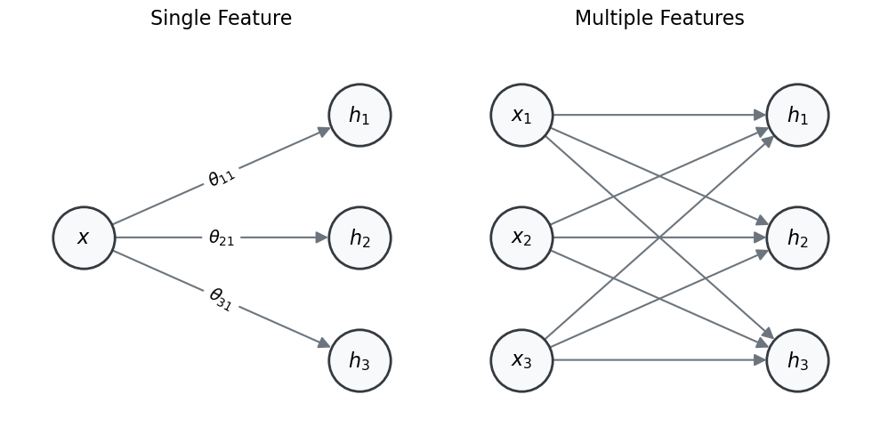

## Aim of the assignment

The goal of this assignment is to understand how backpropagation and neural networks work in practice. 
We’ll implement the core pieces of a **deep neural network (DNN)** ourselves: its linear layers, ReLU, loss, and backpropagation (**Task 1**). Then we’ll rebuild the same idea in PyTorch (a python library), letting it take over the math and use it to revisit the HW1 gene‑expression regression task (**Task 2**).

In each task, we have provided you with a "skeleton" (Jupyter notebook). This code will act as a guide to help you get started so you can focus on the results. Some parts are implemented and can be used as is, while others are left for you to complete and are marked with `# TODO-n` comments.



### Guidelines

**Work in pairs.** One submission per pair.
**Late submission:** 10% penalty per day.
**Submission:** .ZIP file through Moodle, see the **Submission Guidelines** below.

- *Steps* are marked *A., B., ...*. You should complete them either by filling in the TODOs in the skeleton provided or by writing your own code. The completed notebooks should be included in your submission. You will not be evaluated on the code itself, but on the results you obtain and the report you write.
  - The code for the tasks is provided in the form of notebooks that contain specific instructions. You can edit and run them in VSCode, Jupyter Notebook, Google Colab, or Kaggle as described in HW0.
- *Questions* are marked *Q1, Q2, ...*. These require you to answer the questions or use code to create the plots, and then include them in your report.


## Resources

All the code lives in the course repository. Get it with either:

- **[Download all the code (ZIP)](https://github.com/mathoory/00660121-medical-diagnostics/archive/refs/heads/main.zip)**, then unzip it and open the notebooks in Jupyter or VSCode.
- or clone it with `git clone https://github.com/mathoory/00660121-medical-diagnostics` (see HW0).

Inside, the notebooks for this assignment are under `homeworks/03 HW2/src/`:

| Notebook | What you build in it |
|----------|----------------------|
| `task-1/task-1.ipynb` | **Task 1**: a deep neural network from scratch in NumPy. You implement the forward and backward passes of a linear layer, ReLU, and MSE loss, then the training loop. |
| `task-2/task-2.ipynb` | **Task 2**: a PyTorch DNN trained on the gene-expression data and compared against a linear-regression baseline. |



## Tasks

### Task 1 - Basic deep neural network {#sec-task1}
In this task, you will build a deep neural network from first principles, implementing both the forward and backward passes yourself. By completing it you will have implemented:

- Linear layers (forward and backward)
- ReLU activation functions (forward and backward)
- Mean Squared Error (MSE) loss (forward and backward)
- A simple training loop using batch (stochastic) gradient descent (SGD)

For the parts you implement you may use **`NumPy` only** - no PyTorch, TensorFlow, or scikit-learn (some check cells and the last part use PyTorch and require no new code). For a linear-algebra refresher (e.g. what a gradient is), see the [workshop](https://mathoory.github.io/00660121-medical-diagnostics/workshop-0/); consulting LLMs is encouraged too.

#### Background: a deep neural network

A **deep neural network** (also called *feedforward*) is a chain of linear transformations and activation functions applied to an input vector - a flexible hypothesis class ($\mathcal{H}$). We first review the matrix notation of a single layer. In each case, look at how the dimensions of the input and the output relate to the weight matrix $\boldsymbol{\Theta}$ and the bias vector $\boldsymbol{\theta}_0$.

**Single sample, single feature.** Suppose the input is a single scalar $x \in \mathbb{R}$ and we want three hidden features $h_1, h_2, h_3$ using an activation function $a$ (e.g. ReLU). Each hidden feature is a linear transformation of the input followed by the activation:

$$
\begin{aligned}
h_1 &= a(\theta_{10} + \theta_{11} x) \\
h_2 &= a(\theta_{20} + \theta_{21} x) \\
h_3 &= a(\theta_{30} + \theta_{31} x)
\end{aligned}
$$

which we write compactly with vectors and matrices as

$$
\mathbf{h} =
\begin{bmatrix} h_1 \\ h_2 \\ h_3 \end{bmatrix}
= a\!\left(
\begin{bmatrix} \theta_{10} \\ \theta_{20} \\ \theta_{30} \end{bmatrix}
+
\begin{bmatrix} \theta_{11} \\ \theta_{21} \\ \theta_{31} \end{bmatrix} x
\right)
= a(\boldsymbol{\theta}_0 + \boldsymbol{\theta}\, x)
$$

where $\mathbf{h} \in \mathbb{R}^3$ is the hidden vector, $\boldsymbol{\theta}_0 \in \mathbb{R}^3$ is the bias vector, and $\boldsymbol{\theta} \in \mathbb{R}^{3}$ is the weight vector.

{width=80% fig-align="center"}

**Single sample, multiple features.** If $\mathbf{x} \in \mathbb{R}^3$ (i.e. $\mathbf{x} = [x_1, x_2, x_3]$) and we want three hidden units:

$$
\mathbf{h} = a\!\left(
\begin{bmatrix} \theta_{10} \\ \theta_{20} \\ \theta_{30} \end{bmatrix}
+
\begin{bmatrix}
\theta_{11} & \theta_{12} & \theta_{13} \\
\theta_{21} & \theta_{22} & \theta_{23} \\
\theta_{31} & \theta_{32} & \theta_{33}
\end{bmatrix}
\begin{bmatrix} x_1 \\ x_2 \\ x_3 \end{bmatrix}
\right)
= a(\boldsymbol{\theta}_0 + \boldsymbol{\Theta} \mathbf{x})
$$

where now $\mathbf{h} \in \mathbb{R}^3$ is the vector of hidden units, $\boldsymbol{\theta}_0 \in \mathbb{R}^3$ is the bias vector, and $\boldsymbol{\Theta} \in \mathbb{R}^{3 \times 3}$ is the weight matrix.

**Multiple samples (batch input).** In practice we run the model on many samples at once - **batch processing** - which is more efficient and takes advantage of parallel hardware (like GPUs). The input is now a batch $X \in \mathbb{R}^{B \times 3}$, where each **row** is one sample with 3 features:

$$
X =
\begin{bmatrix}
x_1^{(1)} & x_2^{(1)} & x_3^{(1)} \\
x_1^{(2)} & x_2^{(2)} & x_3^{(2)} \\
\vdots    & \vdots    & \vdots    \\
x_1^{(B)} & x_2^{(B)} & x_3^{(B)}
\end{bmatrix}
\in \mathbb{R}^{B \times 3}
$$

We compute the hidden units for all $B$ samples together, so the output has one row per sample:

$$
\begin{aligned}
H &=
\begin{bmatrix} h_{1,1} & h_{2,1} & h_{3,1} \\ h_{1,2} & h_{2,2} & h_{3,2} \end{bmatrix} \\
&= a\!\left(
\begin{bmatrix}
x_1^{(1)} & x_2^{(1)} & x_3^{(1)} \\
x_1^{(2)} & x_2^{(2)} & x_3^{(2)}
\end{bmatrix}
\begin{bmatrix}
\theta_{11} & \theta_{21} & \theta_{31} \\
\theta_{12} & \theta_{22} & \theta_{32} \\
\theta_{13} & \theta_{23} & \theta_{33}
\end{bmatrix}
+
\begin{bmatrix}
\theta_{10} & \theta_{20} & \theta_{30} \\
\theta_{10} & \theta_{20} & \theta_{30}
\end{bmatrix}
\right) \\
&= a\!\left(X \boldsymbol{\Theta}^\top + \mathbf{1}_B\, \boldsymbol{\theta}_0^\top\right)
\end{aligned}
$$

where $\mathbf{1}_B \in \mathbb{R}^{B}$ is a column of ones, so $\mathbf{1}_B\, \boldsymbol{\theta}_0^\top$ is the $B \times 3$ matrix whose every row equals the bias $\boldsymbol{\theta}_0^\top$ - exactly the replicated bias term written out in the line above. Each row of $H$ is the hidden representation of one sample.

**General form.** Writing $\text{in\_dim}$ for the number of input features and $\text{out\_dim}$ for the number of hidden units, a single (batched) layer is

$$
Z = X W^\top + \mathbf{1}_B\, \boldsymbol{\theta}_0^\top \in \mathbb{R}^{B \times \text{out\_dim}}, \qquad H = a(Z)
$$

with $X \in \mathbb{R}^{B \times \text{in\_dim}}$, weight matrix $W = \boldsymbol{\Theta} \in \mathbb{R}^{\text{out\_dim} \times \text{in\_dim}}$, and bias vector $\boldsymbol{\theta}_0 \in \mathbb{R}^{\text{out\_dim}}$ (as above, $\mathbf{1}_B\, \boldsymbol{\theta}_0^\top$ repeats the bias row for each of the $B$ samples). The output of one layer becomes the input of the next, $\mathbf{h}' = a(\boldsymbol{\psi}_0 + \boldsymbol{\Psi}\mathbf{h})$, and so on. The final (output) layer usually skips the activation, especially for regression:

$$
\hat{\mathbf{y}} = \boldsymbol{\phi}^\top \mathbf{h}' + \phi_0
$$

In general, every layer applies the same operation, so for a layer numbered $i$:

$$
\mathbf{h}^{(i)} = a\!\left(\mathbf{h}^{(i-1)} \mathbf{W}^{(i)\top} + \mathbf{b}^{(i)}\right)
$$

where each layer has its own weights $\mathbf{W}^{(i)}$ and biases $\mathbf{b}^{(i)}$, and $a$ is the activation function (e.g. ReLU).

#### Forward and backward passes

**Forward pass.** The sequence of computations from the input layer to the output layer, producing predictions $\hat{y}$ from the current weights and biases. At each layer the inputs are transformed by the layer's parameters, and the output of one layer becomes the input to the next (e.g. a linear layer followed by ReLU: $z = xW^\top + b$, then $\hat{y} = \operatorname{ReLU}(z)$). The forward pass is also used to compute the **loss**, which quantifies how far the predictions are from the true labels - e.g. the MSE:

$$
\mathcal{L} = \frac{1}{N} \sum_{i=1}^N \left( y_i - \hat{y}_i \right)^2
$$

**Backward pass (backpropagation).** The process of computing the gradients of the loss with respect to the model's parameters, using the chain rule applied from the output layer back through the network. At each layer the gradient of the loss is propagated backward and the gradients with respect to the weights, biases, and inputs are computed - e.g. given $\frac{\partial \mathcal{L}}{\partial \hat{y}}$, compute $\frac{\partial \mathcal{L}}{\partial W}$, $\frac{\partial \mathcal{L}}{\partial b}$, and $\frac{\partial \mathcal{L}}{\partial x}$. These gradients are then used to update the parameters with an optimizer such as gradient descent (GD).

#### The task

*A.* Complete all `# TODO‑n` cells in `task-1.ipynb`. Each `# TODO-k` marks a line you must complete - replace the `...` with your code (it helps to derive the relevant equation with pen and paper first, and to read the shape annotations for what each function receives and returns). After a TODO, if a check cell follows, simply run it (no new code required) to verify your implementation; do not modify code outside the `# TODO` sections. Some sections require no new code - read them for context. Once all TODOs are complete, run **all** cells; the model should train on a synthetic regression task and reach a final MSE below `1e-3`.

#### Theoretical questions
Answer 2 questions out of the following 5 concisely (1-2 lines) in your PDF report:

*Q1* What is the purpose of the ReLU activation function?

*Q2* Is backpropagation **required** for training a neural network? Why or why not?

*Q3* What are the main components of the train loop? What is the purpose of each component? Does the order of these components matter? Why or why not?

*Q4* Explain the difference between gradient descent and back-propagation.

*Q5* How many parameters does your DNN have? (PyTorch version), how did you calculate/find it?



### Task 2 - Comparison of LR and neural networks {#sec-task2}
In this task you will revisit the **mini-GEO gene-expression dataset** you used in HW1 and compare your LR results to a deep neural network. Refer to HW1 for the dataset description. Use the exact same CSV you used in HW1 (gene_expression_regression.csv). If you no longer have it locally, re‑download it from HW1.

For this part, you can use `task-2.ipynb` as a starting point.

*A.* Read *2.3 D-GEX* from *[Chen et al., 2016](https://doi.org/10.1093/bioinformatics/btw074)* to understand how deep learning was used to infer gene expression from landmark genes. Remember, we are working with a mini version of the dataset, so the results and methods might differ a bit.

*B.* Linear-Regression baseline: Train a LR model to predict the target gene expression from the landmark genes. Calculate MSE and Pearson *r* on the test set (You may copy/paste your HW1 LR code or use `sklearn.linear_model.LinearRegression`) (TODO-1)

*C.* Design and implement your DNN: Start from the baseline given in `task-2.ipynb` and work according to `TODO-2` (hyper-parameters) and `TODO-3` (model definition). Each one might require a few lines to complete. Consider which [activation function](https://pytorch.org/docs/stable/nn.html#non-linear-activations) you would like to use, how many layers and neurons per layer, and whether you want to use [dropout](https://pytorch.org/docs/stable/nn.html#dropout).

*D.* Train the DNN: Implement the training loop (`TODO-4`; see `task-1.ipynb` for reference).

*E.* Hyper-parameters: Train the DNN with different **depth, width, learning-rate**. Use the **validation** set for selection (`TODO-5`). You may automate this or do a handful of manual runs (5-8).

*Q6* For the DNN, plot the training & validation set loss curves for different hyper-parameters. How did changing each hyper-parameter affect the curves? Report the best performing DNN hyper-parameters and the final model structure.

*F.* Final evaluation & comparison: Retrain the chosen DNN on train + validation sets with the best hyper-parameters found, then evaluate LR and the DNN on the **test set** and compare MSE and Pearson *r*.

*Q7* Discuss and compare the results of the LR model and the DNN (mention MSE, Pearson *r*, and number of parameters).



## Submission Guidelines {#sec-submission}
Submit a single ZIP file with the following structure:

```
HW2_ID1_ID2.zip
├── src/                 # your code files
│   ├── task-1.ipynb     # Task 1: Manual deep neural network
│   ├── task-2.ipynb     # Task 2: Compare LR and deep neural network
│   ├── any other code files for reproducibility...
├── llm_chats/           # exported LLM conversations
└── report_ID1_ID2.pdf   # ≤ 2 pages + charts 
```

**Do not include** any data files in the submission, as they are very large and already available for download.

### Written report guidelines
The report should be a **concise** summary of your work, it should show your understanding of the model, results and reasoning behind your decisions. No need to include code, any equations or algorithms used should be mentioned if we saw them in class or explained otherwise.

- **Content**: 
  - Include your names and IDs on the first page
  - Include answers and results of all parts in the report.
  - Include all plots and figures that help explain your results.
  - Use clear markers for each task and question.
- **Length**: Maximum **2** pages (excluding charts and figures, equations count towards length).
- **Font**: Readable (e.g., Arial) with a minimum size of 11pt and standard margins.
- **Explanations**: Provide clear, short explanations for your model choices, esp. if they diverge from what we've seen in class. Include any challenges you faced and how you solved them.
- **Charts**: Include relevant figures, make sure they are clear and labeled, and provide a brief explanation of how it relates to your results.

### Grading rubric

| Component                                                                    | Pts |
|:-----------------------------------------------------------------------------|:----|
| Written Report                                                               | 50  |
| Full implementation of the models                                            | 15  |
| Theoretical Questions                                                        | 10  |
| Model performance                                                            | 20  |
| Results reproducibility                                                      | 5   |


### Academic integrity & help
* Use any online docs or LLMs, **do not share code or prompts** across pairs.
* Post questions in the **Final project Moodle forum**. Emails regarding the project **will not be answered**. For Private issues email the TA.

Good luck!

### FAQ

Q: Can I use Kaggle/Collab?
A: You may use any platform for development, but your final submission should follow the required folder structure and include files as specified.

Q: What libraries can I use?
A: For the first parts of **Task 1**, you are allowed to use NumPy alone. For the other sections, you may use any library, but you cannot use any pre-built models. 

Q: Do I need a GPU to run this assignment?
A: Using a GPU will speed up training times, but it is not required. You can run the assignment without it.

Q: What language may I use for the report and code?
A: Report: English recommended, Hebrew accepted. Code: any language, but Python is recommended for compatibility with the provided code.

Q: What should I do if my results are different each run?
A: Make sure to set all random seeds (e.g., random_state=42 in train_test_split and for any random number generators you use) for reproducibility.

Q: What Loss function should I use?
A: You can use any loss function that is suitable. If we have not seen it in class, please explain it in your report.

Q: What does reproducibility mean?
A: Reproducibility means that anyone who runs your code and provides the data should be able to obtain the same results as you did.