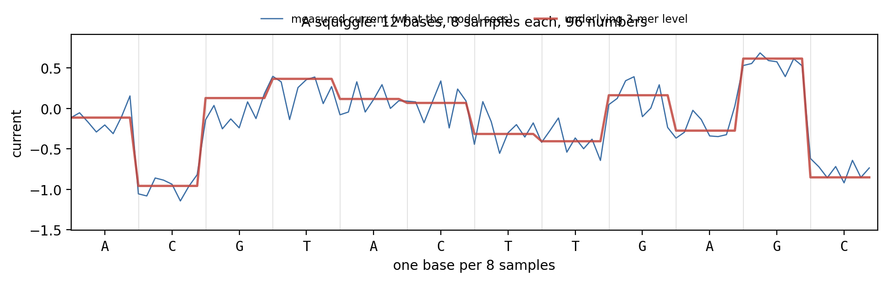

## Aim of the assignment

Convolutional Neural Networks (CNNs) and Transformers are two landmark deep learning architectures. The goal of this project is to (1) understand how they work in practice, (2) apply them to sequence data to solve problems in computational biology, and (3) learn about modern methodologies for implementing and training them.

We start with sequence classification: a CNN that predicts whether an RNA-binding protein (RBP) binds a given sequence. We then use the trained model to find the sequence motifs it learned ([Task @sec-task-cnn]). Next we move to sequence-to-sequence modelling with the architecture behind modern language models: a Transformer that reads a noisy nanopore current signal and calls the DNA sequence behind it, a task known as *basecalling* ([Task @sec-task-tx]). The Transformer's core idea, self-attention, is the same one that powers language models, and we will see why it succeeds where a CNN cannot.

Both tasks build directly on how you built a network from layers in HW2. What is new is the architecture in each case, and what you can learn by looking inside a trained model to explain its behavior (known as explainability or [XAI](https://en.wikipedia.org/wiki/Explainable_artificial_intelligence)).

In each task we provide a "skeleton" (Jupyter notebook) to help you get started and focus on the main concepts instead of the code structure. Some parts are implemented and can be used as is, while others are left for you to complete and are marked with `# TODO-n` comments.


### Guidelines

**Work in pairs.** One submission per pair.
**Late submission:** 10% penalty per day.
**Submission:** .ZIP file through Moodle, see @sec-submission.

- *Steps* are marked *A., B., ...*. You should complete them in the provided Jupyter notebooks. Either by filling in the TODOs or by writing your own code. The completed notebooks should be included in your submission. You will not be evaluated on the code itself, but on the results you obtain and the report you write.
  - Each notebook contains its own instructions, so read it alongside this document. You can edit and run the notebooks in VSCode, Jupyter Notebook, Google Colab, or Kaggle as described in HW0.
- *Questions/Plots* are marked *Q1, Q2, ...*. These require you to answer the questions or use code to create the plots, and then include them in your report.

### Resources

All the code lives in the course repository. Get it with either:

- **[Download all the code (ZIP)](https://github.com/mathoory/00660121-medical-diagnostics/archive/refs/heads/main.zip)**, then unzip it and open the notebooks in Jupyter or VSCode.
- or clone it with `git clone https://github.com/mathoory/00660121-medical-diagnostics` (see HW0).

The ZIP contains the whole course repository, which is the simplest way to always get the current version. If something is updated you can re-download it and copy over just the notebook you need.

Inside, the notebooks for this project are under `homeworks/04 Final Project/src/`:

| Notebook | What you will do in it |
|----------|----------------------|
| `task-1/task-1.ipynb` | Task 1 - train a CNN to recognise RNA sequences that bind the AGO2 protein, then look at what it learned. |
| `task-2/task-2.ipynb` | Task 2 - build a Transformer that reads raw nanopore signal and calls the DNA bases behind it. |

### Running on a GPU (read this before you start) {#sec-gpu}

Both tasks in this project need a GPU. Deep learning is millions of matrix multiplications, which a GPU performs in parallel and finishes roughly 10-30x faster than a laptop CPU. On a CPU, one training epoch of Task 1 can take an hour instead of a few minutes.

You have free GPU access on Google Colab and on Kaggle Kernels, and both give you a limited number of GPU hours per week, which is enough for this project if you plan your runs. See HW0 for how to get started on either.

> Video walkthrough (from last year - different project, same method, watch from 1:23): [enabling a GPU on Google Colab](https://panoptotech.cloud.panopto.eu/Panopto/Pages/Viewer.aspx?id=c314b446-3967-43c0-aac9-b33c00d18668)

**How to not waste your quota.** The GPU clock runs whether or not your code is correct, and most of the time you lose is spent on runs that crash three minutes in, or that you did not need in the first place.

1. **Debug on CPU first, on a deliberately tiny problem.** In Task 1, load only a few hundred sequences and train for one epoch. In Task 2, drop `steps` to a few dozen. You are not looking for good accuracy here, only for code that runs end to end without errors.
2. **Only then switch the runtime to GPU** and scale up to the full data and a realistic number of epochs.
3. **Decide what each run is testing before you launch it.** Changing three hyper-parameters at once tells you nothing about which one mattered.
4. **Save your results as you go** (metrics, plots), so a disconnected session does not cost you a rerun. Colab and Kaggle both disconnect idle sessions.




## Tasks

### Task 1 - CNN for RNA-protein binding sites {#sec-task-cnn}

#### Introduction

RNA-binding proteins ([RBPs](https://en.wikipedia.org/wiki/RNA-binding_protein)) regulate RNA after transcription. Cross-linking and immunoprecipitation followed by high-throughput sequencing ([CLIP-Seq](https://en.wikipedia.org/wiki/Cross-linking_immunoprecipitation)) captures short RNA fragments crosslinked to a specific RBP, here [AGO2](https://en.wikipedia.org/wiki/EIF2C2). To try and pinpoint sequence patterns (motifs) that drive RBP recognition (what sequence does AGO2 bind to?), we attempt to use computational analysis. Deep convolutional neural networks (CNNs) have proven useful for this task: their filters can capture sequence motifs and higher-order dependencies.

In the following exercises you will:

- Preprocess the data: convert raw CLIP-Seq reads into one-hot encoded sequences suitable for CNN input.
- Build and train a CNN model in PyTorch to predict the binding probability of a given sequence to the AGO2 protein. $$f(\text{sequence})=P(\text{binding}|\text{sequence})$$
  - For example: $f(\text{ACGUACGUACGU})=0.87$ means that the model predicts a probability of 0.87 that the sequence `ACGUACGUACGU` binds to AGO2.
- Tune hyper-parameters and benchmark performance
- Visualize binding motifs

##### Dataset & background  
You can download the dataset files from [here](https://technionmail.sharepoint.com/:u:/s/RoeeAmitLabSharepoint/EXA8De2rHrhIsj0oJUo3SMUB6UOa6hVH3v6jvEu7CrsH-A?e=AxFX3r) or from [kaggle](https://www.kaggle.com/datasets/cdncdn/clipseq-ago2)

| File | Purpose |
| -- | -- |
| `CLIPSEQ_AGO2.train.positives.fa` | Training positives |
| `CLIPSEQ_AGO2.train.negatives.fa` | Training negatives |
| `CLIPSEQ_AGO2.ls.positives.fa` |  Validation positives |
| `CLIPSEQ_AGO2.ls.negatives.fa` |  Validation negatives |

Unzip the archive and place the four `.fa` files in the same directory as the notebook, keeping these exact names. On Google Colab, upload them into the session (they are deleted when the session restarts). On Kaggle, add the linked dataset to your notebook. The archive also contains a `utils/` folder - you do not need it, `task-1.ipynb` is self-contained.

**References:**  
Pan, Xiaoyong, and Hong-Bin Shen. “Predicting RNA-protein binding sites and motifs through combining local and global deep convolutional neural networks.” Bioinformatics (Oxford, England) vol. 34,20 (2018): 3427-3436. [https://doi.org/10.1093/bioinformatics/bty364](https://doi.org/10.1093/bioinformatics/bty364)

##### Compute for this task
This is the heavier of the two tasks: about 92,000 training sequences (plus 1,000 for validation), and you will train several architectures. Use a GPU (see @sec-gpu), and debug on a few hundred sequences for a single epoch before you scale up.


#### Instructions

*A.* Read the Introduction and Materials and methods (up to and including 2.4) of the publication above (Pan & Shen, 2018). Their work is our inspiration rather than a specification: we build one global CNN of our own design and skip their local CNN and the ensemble. Section 2.4 is the basis for the motif part of this task. 

*Q1* Explain the role of the AGO2 protein,

*Q2* How can CNN filters capture sequence motifs? What is the purpose of the convolutional layers, and how do they differ from fully connected ones? Once you have built your model, support your answer with its own numbers: how many parameters are in your first convolutional layer, and how many would a fully connected layer covering the same input need?

*Q3* Report number of positive and negative sequences in the train and validation sets.

*Note on splits:* this task has only two sets. Train only on the `train.*` files. The `ls.*` files are never trained on, and they play both roles that HW1 and HW2 split between a validation and a test set: you compare architectures by their `ls.*` score, and you also report your final numbers on `ls.*`. There is no third set here. Because you chose your architecture by looking at these sequences, your reported score is a mildly optimistic estimate of true performance, which is worth a sentence in your report.

*B.* Implement the CNN model in `task-1.ipynb` (TODO-1) and the validation loop (TODO-2).

One fact about the shapes is worth knowing before you start, because it is about the data rather than about PyTorch. Your input is $(N, 1, 4, L)$, where the height is the four nucleotide rows. The first convolution spans all four of them at once, so after it the height is $1$ and stays $1$: from there on, every layer is working along the length of the sequence only.

*C.* Train the model using different architectures and any hyper-parameters you find relevant. Remember, you are limited to the GPU time quota. The term architecture here refers to the model layers and their parameters. For example: number of convolutional layers, their kernel sizes, and the number of filters in each layer. You can also experiment with different learning rates, batch sizes, and optimizers.

*Q4* Plot the learning curves on the train set (loss vs epochs), and theorize how your architecture affected the learning process.

*D.* Model evaluation: In HW1 we have seen how TPR and FPR can be used to measure the performance of a binary classifier. In this task, we will use the ROC curve and AUC to evaluate our model. Here, we train a model that outputs a score (higher = more likely bound). To turn scores into 0/1 calls we pick a threshold. Different users may want high sensitivity or high specificity and may choose different thresholds accordingly.

The [Receiver Operating Characteristic (ROC) curve](https://developers.google.com/machine-learning/crash-course/classification/roc-and-auc) shows how sensitivity (True Positive Rate, TPR) trades off against 1-specificity (False Positive Rate, FPR) as you vary the decision threshold from 1.0 down to 0.0. 

Reminder: Each threshold classifies examples based on their score.

$$\tilde y_{i,\text{binary}} = \begin{cases}
  1 & \text{if } \text{score} \ge \text{threshold}\\[2pt]
  0 & \text{otherwise}.
  \end{cases}
$$ 

Because this threshold can be varied, we are interested in how the model performs across all thresholds, not just the one that maximizes accuracy. For each threshold, we can compute:

* $\text{TPR} = \text{TP} / (\text{TP} + \text{FN})$  "of all real positives, how many did we catch?”
* $\text{FPR} = \text{FP} / (\text{FP} + \text{TN})$  "of all real negatives, how many did we wrongly call positive?”

**A worked example.** Say we have 10 validation sequences, 5 that really bind (1) and 5 that do not (0), and the model gives each one a score:

| score | 0.95 | 0.88 | 0.71 | 0.63 | 0.55 | 0.44 | 0.31 | 0.22 | 0.14 | 0.05 |
|-------|------|------|------|------|------|------|------|------|------|------|
| true label | 1 | 1 | 0 | 1 | 1 | 0 | 1 | 0 | 0 | 0 |

Now sweep the threshold. Everything at or above it is called "binds", everything below is called "does not bind":

| threshold | TP | FP | FN | TN | TPR | FPR |
|-----------|----|----|----|----|-----|-----|
| 0.90 (very strict) | 1 | 0 | 4 | 5 | 0.2 | 0.0 |
| 0.60 | 3 | 1 | 2 | 4 | 0.6 | 0.2 |
| 0.50 | 4 | 1 | 1 | 4 | 0.8 | 0.2 |
| 0.20 (very permissive) | 5 | 3 | 0 | 2 | 1.0 | 0.6 |

Read the pattern: lowering the threshold can only raise TPR and FPR together, never one alone. A strict threshold misses real binders (low TPR) but almost never raises a false alarm (low FPR). A permissive one catches every binder (TPR 1.0) at the cost of calling non-binders positive (FPR 0.6). Each row of that table is one point $(\text{FPR}, \text{TPR})$ on the ROC curve, and the curve is what you get by sweeping the threshold continuously.

**How to read the curve.** The x-axis is FPR (lower is better) and the y-axis is TPR (higher is better), so the ideal model hugs the top-left corner: it catches every real binder without a single false alarm. The diagonal from $(0,0)$ to $(1,1)$ is what random guessing looks like, so a curve sitting on the diagonal means the scores carry no information. The further your curve bows towards the top-left, the better the model.

This gives us two things:

* **Comparing models.** The Area Under the ROC Curve (AUC-ROC) is the area under that graph, a single number summarising performance across *all* thresholds. 0.5 is random guessing, 1.0 is perfect. Because it does not depend on any one threshold, it is a fair way to compare two architectures.
* **Choosing a threshold.** The curve shows what each choice costs. A screening assay where missing a binder is expensive would pick a point high up the curve and accept the false alarms. An experiment where testing each candidate is expensive would pick a point far to the left and accept missing some binders.

To calculate the AUC-ROC and plot the ROC curve, you can use the [`roc_curve`](https://scikit-learn.org/stable/modules/generated/sklearn.metrics.roc_curve.html) and [`roc_auc_score`](https://scikit-learn.org/stable/modules/generated/sklearn.metrics.roc_auc_score.html) functions from the scikit-learn library.

*Q5* Final held-out metrics: for your best model, report the accuracy, plot the ROC curve, and report the AUC - all on the validation (`ls.*`) set.

*Q6* Report the model's architecture: a short layer-by-layer description (shapes and total trainable parameters).



#### Interpretation: Motif Prediction

Now that we have a model, we can predict for each sequence whether it binds or not, but we also want to know *why* it made that decision. That means, we would like to find out what sequence patterns the model learned to recognize as binding sites. This is known as *motif discovery*. [Sequence motifs](https://en.wikipedia.org/wiki/Sequence_motif) are short, recurring nucleotide patterns that are statistically enriched (more frequent) in binding sites and we will use them to capture the base-level preferences of an RBP. A motif can be represented as a Position Weight Matrix (PWM) - see example below: for each position in the motif (say length 10), we sum how often A, C, G, or U occurs across many aligned instances and convert those counts to probabilities. Tall columns in a logo mean strong base preference, flat columns mean weak ones. 

$$
\underbrace{
\begin{array}{c|cccc}
     & 1 & 2 & 3 & 4 \\\hline
\text{read 1}  & A & C & G & U \\
\text{read 2}  & A & U & G & U \\
\text{read 3}  & A & C & U & U \\
\end{array}
}_{\text{Raw Sequences}}
\;\Longrightarrow\;
\underbrace{
\begin{array}{c|cccc}
      & A      & C      & G      & U      \\\hline
1     & 1      & 0      & 0      & 0      \\
2     & 0      & \tfrac{2}{3} & 0      & \tfrac{1}{3} \\
3     & 0      & 0      & \tfrac{2}{3} & \tfrac{1}{3} \\
4     & 0      & 0      & 0      & 1      \\
\end{array}
}_{\text{PWM}}
\;\Longrightarrow\;
\underbrace{
\mbox{\raisebox{-0.5\height}{\includegraphics[height=3em]{assets/pwm-logo-example.png}}}
}_{\text{Sequence logo (motif)}}
$$

In full research pipelines, investigators locate motifs by opening up a trained convolutional neural network and inspecting its first-layer filters, which act like motif detectors. That is exactly what we will do here, and the procedure is short enough to write yourself.

The idea is that you do not need to read a filter's weights to find out what it looks for. You can watch it work. We will apply the first convolutional layer on positive (binding) examples from our dataset, and record the outputs. Wherever a filter produces a high value, it has met a pattern it "likes". We can then save all preferred patterns. We wll use those to create a PWM, and the PWM drawn as letters is the logo.

"Likes" needs a number attached to it. We use the same rule as the paper: for each filter we compute a **cutoff**, and any position where that filter's output is above its cutoff counts as a hit.

$$\text{cutoff} \;=\; \text{mean} \;+\; 0.5 \times (\text{max} - \text{mean})$$

The mean and the maximum are taken over that filter's output across all sequences and all positions, so the cutoff sits halfway between a filter's typical response and its strongest one, and each filter gets its own. There is nothing here for you to tune.

**A worked example.** Take one filter of width $k = 4$. It sits on the sequence, reads the 4 bases under it, and returns one number. Then it slides along by one and does it again:

$$
\begin{array}{rlcl}
 & \mathtt{G\;G\;A\;C\;G\;U\;A\;A} & & \\[4pt]
\text{pos 1} & \mathtt{\underline{G\;G\;A\;C}\;G\;U\;A\;A} & \to & 0.0 \\
\text{pos 2} & \mathtt{G\;\underline{G\;A\;C\;G}\;U\;A\;A} & \to & 0.1 \\
\text{pos 3} & \mathtt{G\;G\;\underline{A\;C\;G\;U}\;A\;A} & \to & \mathbf{2.4} \\
\text{pos 4} & \mathtt{G\;G\;A\;\underline{C\;G\;U\;A}\;A} & \to & 0.3 \\
\text{pos 5} & \mathtt{G\;G\;A\;C\;\underline{G\;U\;A\;A}} & \to & 0.0
\end{array}
$$

Five placements, so five numbers. Do the same for two more sequences:

$$
\begin{array}{c|c|ccccc}
 & \text{sequence} & \text{pos }1 & \text{pos }2 & \text{pos }3 & \text{pos }4 & \text{pos }5\\\hline
\text{seq }1 & \texttt{GGACGUAA} & 0.0 & 0.1 & \mathbf{2.4} & 0.3 & 0.0\\
\text{seq }2 & \texttt{CCUUAGCA} & 0.2 & 0.0 & 0.1 & 0.0 & 0.1\\
\text{seq }3 & \texttt{AUCGUACC} & 0.0 & \mathbf{1.9} & 0.4 & 0.0 & 0.0
\end{array}
$$

There are 15 numbers in total. Their mean is $5.5 / 15 = 0.37$ and the largest is $2.4$, so

$$\text{cutoff} = 0.37 + 0.5 \times (2.4 - 0.37) = 1.38 .$$

Two of the 15 placements are above $1.38$: position 3 of sequence 1, and position 2 of sequence 3. Everything else is background. For each hit we take the $k = 4$ bases starting at that position:

- seq 1, position 3 $\rightarrow$ `ACGU`
- seq 3, position 2 $\rightarrow$ `UCGU`

Those two strings are what we keep. Note they are **aligned**: both start where the filter fired, so their first letters correspond to each other, and we can stack them and count. With 4-mers from thousands of real sequences instead of two, counting the bases at each of the four positions gives the PWM, and the PWM drawn as letters is the logo.

Your own sequences vary in length (most are 200-375 bases) and are padded out to $L = 501$ before they reach the network, so with a width-10 filter each one gives $501 - 10 + 1 = 492$ numbers. Windows falling in the padding are discarded, and a filter still usually fires on a few thousand real positions across the dataset.

Each filter gives you one logo. Some will show a clear preference and others will look almost flat, which is itself informative: not every filter learns something worth reading.

**In short:** apply the filter, keep the windows that score above the cutoff, count them into a PWM, draw the logo.

*E.* **Read a motif off the model.** Complete the readout in `task-1.ipynb` (TODO-3) by assembling the provided helpers. Export a handful of filters, turn them into logos with [WebLogo](https://weblogo.threeplusone.com/create.cgi), and include two or three in your report. Expect some to come out flat: a filter that learned nothing is a result too.

*Q7* Looking at your logos: what kind of sequence does your model prefer? Which filter did you take forward to the next step, and why? What is it about its picture that made you pick it? Any outliers?

As we have seen in class, learned filters (weights) differ from model to model and are not always easily explainable. Your logos will not match your classmates' exactly, and that is expected. Usually these results are validated against known literature.

*F.* **Test the motif.** A logo is a *claim* about what the model responds to, and so far nothing has tested it. In `task-1.ipynb` (TODO-4) you will put the claim to the model directly: score a batch of random sequences, then plant your motif into those same sequences and score them again, using several copy numbers so you get a **dose-response** curve. If the model really responds to the pattern, more copies should push the score up.

The part that makes this an experiment rather than a demonstration is the **control**. A rise in score after planting a G/C-rich motif could mean the model responds to that specific pattern, or merely that it likes G/C-rich sequences. You have to build a comparison that separates those two explanations, run it alongside the real motif, and say in your report what you chose and why it isolates what you want.

*Q8* Report your dose-response curve for the real motif and for your control, and state what control you used and why it isolates the pattern from its base composition. Does the model respond to the pattern, to its composition, or to neither?

#### Two notes on Section 6

**Attention weights are not proof of use.** A bright pattern shows where attention weight went, not that the model used what it found there. Information also travels through the residual connections, and the prediction is read off the last block rather than the one you plot. Whether attention weights count as an explanation at all is an open argument in the literature (Jain and Wallace, 2019; Wiegreffe and Pinter, 2019). This is why the ablation in step *E* carries more weight than the picture in step *F*: breaking something and watching accuracy fall is evidence of a different kind.

**The orientation rule is a teaching device.** A real basecaller reports whatever strand went through the pore and never complements anything, because matching a read to the right strand of a reference genome happens later, during alignment. We folded that step into the model so the task would contain one long-range dependency you can see and study. The mirroring is real bookkeeping. The adapter that flags which reads need it is our invention.

#### Theoretical questions


*Q9* Can the fully connected layers in the model be of any size? Why or why not? What is the effect of the size of the fully connected layer on the model's performance?



### Task 2 - Transformer for nanopore basecalling {#sec-task-tx}

#### Introduction

[Nanopore sequencing](https://en.wikipedia.org/wiki/Nanopore_sequencing) reads DNA by pulling a single strand through a protein pore and measuring the ionic current across it. The bases inside the pore set the current, so a read arrives as a noisy one-dimensional signal called a *squiggle*:

{#fig-squiggle width=100%}

[Basecalling](https://en.wikipedia.org/wiki/Base_calling) is the inverse problem: recover the sequence from the squiggle. In @fig-squiggle you can read the answer off the picture because the bases are printed underneath. Your model gets only the blue line. Production basecallers, such as Oxford Nanopore's [Dorado](https://nanoporetech.com/platform/technology/basecalling), do this with a Transformer.

You will build one. The function you are modelling is

$$f(\text{squiggle}) = \texttt{ACGT}\ldots$$

one letter for every base that went through the pore.

Work `task-2.ipynb` in order. You will build the CNN you already know from Task 1 before you build anything new, because where it breaks is the reason the Transformer exists.

#### The data

You will not download anything for this task. You will *generate* your reads.

In Task 1 you were handed files of real RNA sequences, with labels somebody else had
established in a lab. Here you start from the opposite end. You draw a random strand of DNA,
simulate the current a pore would measure as that strand passed through it, and hand the
model that simulated current. Because you invented the strand in the first place you already
know every base of the answer, so the label is exact and free. People who build real basecallers train them this way too,
because the physics of the pore is understood well enough to imitate convincingly.

A fresh batch is drawn at every training step, so your model never sees the same read twice and there is nothing to hold out: no
train, validation and test split. And `evaluate` draws its reads from a fixed seed, so any
two models you train are scored on exactly the same reads, as is every submission at grading
time.

Two settings control how degraded the reads are, and you will use them in step *D*:

- `noise`, the strength of the noise on the current.
- `hetero`, which makes the noise level vary along the read.

##### The pore model

Three bases sit in the pore at once and all three affect the current. Every possible 3-mer
has its own characteristic level, and that table of $4^3 = 64$ numbers is the *pore model*.
A few entries from ours:

```
AAA  +0.30        ACG  +0.13        GTA  +0.12
AAC  -1.04        CGT  +0.37        TAC  +0.07
```

The strand ratchets through one base at a time, so the pore holds a different 3-mer at every
step. Reading the strand `ACGTAC`, the pore sees a sliding window:

```
strand       A C G T A C

pore holds   A C G                ->  +0.13
               C G T              ->  +0.37
                 G T A            ->  +0.12
                   T A C          ->  +0.07
```

One step gives one level, so a 60-base read gives 60 levels. Each level is held for 8
samples while the strand pauses there, and Gaussian noise is added on top. A read therefore
arrives as $60 \times 8 = 480$ numbers.

That is exactly @fig-squiggle: the red line is those levels, the blue line is the same thing after noise, and each flat stretch is one step of the ratchet.

Notice what this costs you: a base cannot be identified on its own, because the level at
each step depends on the two bases before it as well.

##### The two strands, and the adapter

DNA is double-stranded and antiparallel. The pore reads whichever strand it happens to
capture, 5' to 3'. Capture the forward strand and the pore reads the forward sequence.
Capture its partner and the pore reads the *reverse complement*: every base swapped for its
pair (A-T, C-G), in the opposite order.

We always want the forward strand reported, whichever one was captured:

$$
f(\text{squiggle from } \texttt{ACGTAC}) = \texttt{ACGTAC}
\qquad
f(\text{squiggle from } \texttt{GTACGT}) = \texttt{ACGTAC}
$$

Those are two different squiggles, built from different 3-mers, and $f$ has to return the
same answer for both:

```
forward strand      A C G T A C     this is always the answer

forward capture     A C G T A C     the pore reads the answer directly
reverse capture     G T A C G T     the answer is this, complemented and reversed
```

So on a reverse capture the first base of the answer is set by current measured at the *end*
of the read, and the last base by current measured at the start.

This split is how real sequencing works. A basecaller writes down whatever passed through the
pore, and the *aligner* decides afterwards which strand it came from and flips it if needed.
Here a single model does both jobs.

Which leaves the model a problem. Two random strands are statistically identical, so nothing
in the current levels says which of the two cases it is looking at, and without knowing that
it cannot know whether to reverse anything. Real reads carry a sequencing **adapter**, a
known stretch ligated on before sequencing that passes through the pore ahead of the DNA. In
our generator, reverse captures carry a leftover adapter signal at the very start of the read
and forward captures do not. That one feature is the only thing separating them.

#### What the model outputs

As in Task 1, the model produces numbers rather than letters. Task 1 gave one number per sequence. Here we need one of four choices at each of 60 positions, so the output is a $60 \times 4$ grid of scores, and the largest entry in each row is that base's call:

$$
O \;=\;
\begin{array}{c|cccc}
 & \texttt{A} & \texttt{C} & \texttt{G} & \texttt{T} \\\hline
\text{base } 1 & 2.7 & -0.4 & 0.1 & -1.2 \\
\text{base } 2 & -0.9 & 0.2 & 3.1 & 0.0 \\
\vdots & & & & \\
\text{base } 60 & 0.3 & -1.1 & 0.4 & 2.2
\end{array}
\;\in\; \mathbb{R}^{60 \times 4}
\qquad\Longrightarrow\qquad
\hat{y} = \texttt{A}\,\texttt{G}\ldots\texttt{T}
$$

Row 1's largest entry is $2.7$ under `A`, so base 1 is called `A`. The loss function compares this grid with the true bases, and the notebook provides it.

#### Tokenization

The 480 raw samples are not a useful input on their own. The first layer groups each step's 8 samples into a single vector of width $d$, called a **token**, giving 60 tokens per read:

$$
\underbrace{s \in \mathbb{R}^{480}}_{\text{480 current samples}}
\quad\longrightarrow\quad
\underbrace{X \in \mathbb{R}^{T \times d}}_{T = 60 \text{ tokens}}
$$

One token holds everything the model knows about one step of the ratchet. You choose $d$, which is the `d_model` setting. The layer is a convolution of width 8 and stride 8, the Task 1 trick again, here stepping one base at a time.

The stack takes $T$ tokens and returns $T$ tokens. Only the width changes, and the head turns each token into its 4 scores.

#### Self-attention

This is the mechanism from Tutorial 4. Each token $x_i$ produces a query, a key and a value, and the attention weight from token $i$ to token $j$ compares $i$'s query with $j$'s key, scaled by the key width $d_k$:

$$
a_{ij} = \operatorname{softmax}_j\!\left( \frac{q_i \cdot k_j}{\sqrt{d_k}} \right),
\qquad
z_i = \sum_{j=1}^{T} a_{ij}\, v_j .
$$

The sum runs over every token $j$, so any token can draw on any other, near or far.

#### Building the model

You assemble the architecture the same way you assembled the CNN in Task 1, as a list of layers applied in order:

$$
\text{signal} \;\to\; [\text{Tokenizer}] \;\to\; +[\text{Positional encoding}] \;\to\; N\times[\text{Encoder block}] \;\to\; [\text{Head}] \;\to\; \texttt{ACGT}
$$

- **Tokenizer**: the convolution above. Turns the 480 samples into $T$ tokens of width `d_model`.
- **Positional encoding**: attention alone has no notion of order, so a fixed position signature is added to each token. As in the tutorial it is added to the tokens, not applied as a layer.
- **Encoder block**: self-attention followed by a small per-token network, plus several things that keep a deep stack trainable. It is written for you and nothing inside it is yours to change, though you will look at one part of it in Section 6. You stack `n_layers` of them.
- **Head**: a `Linear` layer turning each token into its 4 scores, like the `Linear(..., 1)` that ended your CNN in Task 1, with 4 outputs instead of 1.

Your architecture decisions are four sizes:

| setting | what it controls |
|---|---|
| `d_model` | the width of a token. Every token carries this many numbers, from the tokenizer all the way to the head. |
| `n_layers` | how many encoder blocks you stack, one feeding into the next. |
| `n_heads` | how many attention patterns each block computes side by side, the *heads* from Tutorial 4. They divide `d_model` between them, so `d_model` must be a multiple of `n_heads`. |
| `d_ff` | the width of the small per-token network inside each block. It is normally a small multiple of `d_model`. |

Nothing tells you what the right values are. Finding out is step *D*.

#### Instructions

Work through `task-2.ipynb` in order. Each step corresponds to one section of the notebook.

*A.* **Look at the data** (Section 1). Read the generator and plot a few reads of each kind.

*Q10* What separates a forward capture from a reverse one in the signal? And on a reverse capture, which part of the signal determines the first base you have to report?

*B.* **Build the CNN** (Section 2, `TODO-1`) and train it. `evaluate` reports overall accuracy and the two orientations separately.

*Q11* Report your CNN's accuracy overall and on each orientation, and explain the result. What property of a convolutional architecture is responsible, and would adding more filters help?

*C.* **Build the Transformer** (Section 3, `TODO-2` and `TODO-3`). Assemble it from the provided layers, choose your sizes, and train it on the same data. Note the parameter counts that `train` prints, since the two models are deliberately close in size.

*Q12* Report your Transformer's accuracy next to your CNN's. What changed, and what does that tell you about the two architectures?

*D.* **Choose an architecture** (Section 4, `TODO-4`). Vary the model sizes and the data settings, and keep the runs you need to justify a choice. Then train your chosen model in the graded regime, `noise=0.5, hetero=0.6`.

*Q13* Report your final architecture (`d_model`, `n_heads`, `n_layers`, `d_ff`, and total parameters) and justify it with your plots, including accuracy against noise for at least two model sizes.

*E.* **Ablation** (Section 5, `TODO-5`). Predict what removing the positional encoding will do to each orientation, then rebuild with `use_pe=False`, keeping every other size fixed, and retrain.

*Q14* State the prediction you made, report both orientations with and without the positional encoding, and explain the difference.

*F.* **Look inside it** (Section 6). Run the attention plot on a reverse capture and work out which head is doing which job.

*Q15* Which head in your model is doing what, and what gave each one away? Relate this to your answer in *Q11*. Does a large attention weight prove the model used the position it points at? Say what evidence would settle it.

#### Theoretical question

*Q16* In a short paragraph, relate self-attention here to its use in protein language models, which attend across amino-acid residues. Why is the ability to look across a whole sequence useful in biology?

#### Model performance (competitive factor)

Part of the grade rewards accuracy in a fixed, harder regime (`noise=0.5, hetero=0.6`). Because `evaluate` draws from a fixed seed, every submission is scored on identical reads. Report your final accuracy.

#### Compute for this task

A 3,000-step run takes about a minute on a free Colab GPU. The reads are generated on the CPU, and on Colab that generation sets the pace rather than the GPU, so a larger model costs very little extra time. What costs you is the number of runs. Debug with `steps` cut to a few dozen before launching a sweep.



## Submission Guidelines {#sec-submission}
Submit a single ZIP file with the following structure:

```
final_project_ID1_ID2.zip
├── src/                 # your code files
│   ├── task-1/task-1.ipynb   # Task 1: CNN for RNA-protein binding sites
│   ├── task-2/task-2.ipynb   # Task 2: Transformer for nanopore basecalling
│   ├── any other code files for reproducibility...
├── llm_chats/           # exported LLM conversations (see note below)
└── report_ID1_ID2.pdf   # < 5 pages + charts
```

Do not include any data files in the submission, as they are very large and already available for download.

**LLM chat logs.** As in HW1 and HW2: if you used LLMs (e.g. ChatGPT, Claude, Gemini, Copilot) at any stage, export the full conversation(s) into `llm_chats/` (PDF, Markdown, or a `.txt` with shareable links).

### Written report guidelines
The report should be a concise summary of your work, it should show your understanding of the model, results and reasoning behind your decisions. No need to include code, any equations or algorithms used should be mentioned if we saw them in class or explained otherwise.

- **Content**: 
  - Include your names and IDs on the first page
  - Include answers and results of all parts in the report.
  - Include all plots and figures that help explain your results.
  - Use clear markers for each task and question.
- **Length**: Maximum 5 pages (excluding charts, figures and tables; equations count towards length).
- **Font**: Readable (e.g., Arial) with a minimum size of 11pt and standard margins.
- **Explanations**: Provide clear, short explanations for your model choices, esp. if they diverge from what we've seen in class. Include any challenges you faced and how you solved them.
- **Charts**: Include relevant figures, make sure they are clear and labeled, and provide a brief explanation of how it relates to your results.

### Grading rubric

| Component                                                                    | Pts |
|:-----------------------------------------------------------------------------|:----|
| Written Report                                                               | 30  |
| Full implementation of the models                                            | 30  |
| Theoretical Questions                                                        | 20  |
| Model performance (competitive factor)                                       | 15  |
| Results reproducibility                                                      | 5   |


### Academic integrity & help
* Use any online docs or LLMs, do not share code or prompts across pairs.
* Post questions in the Final project Moodle forum. Emails regarding the project will not be answered. For Private issues email the TA.

Good luck!

### FAQ

Q: Can I use Kaggle/Collab?
A: You may use any platform for development, but your final submission should follow the required folder structure and include files as specified.

Q: What libraries can I use?
A: You may use any library, but you cannot use any pre-built models - in particular, assemble the Transformer from the provided building blocks rather than using `torch.nn.Transformer`.

Q: Do I need a GPU to run this assignment?
A: Using a GPU will significantly speed up training times for both tasks. You should use the free GPUs available on platforms like Google Colab or Kaggle.

Q: What language may I use for the report and code?
A: Report: English recommended, Hebrew accepted. Code: any language, but Python is recommended for compatibility with the provided code.

Q: What should I do if my results are different each run?
A: Make sure to set all random seeds (e.g., random_state=42 in train_test_split and for any random number generators you use) for reproducibility.

Q: What Loss function should I use?
A: You can use any loss function that is suitable. If we have not seen it in class, please explain it in your report.

Q: What does code reproducibility mean?
A: Code reproducibility means that anyone who runs your code and provides the data should be able to obtain the same results as you did.