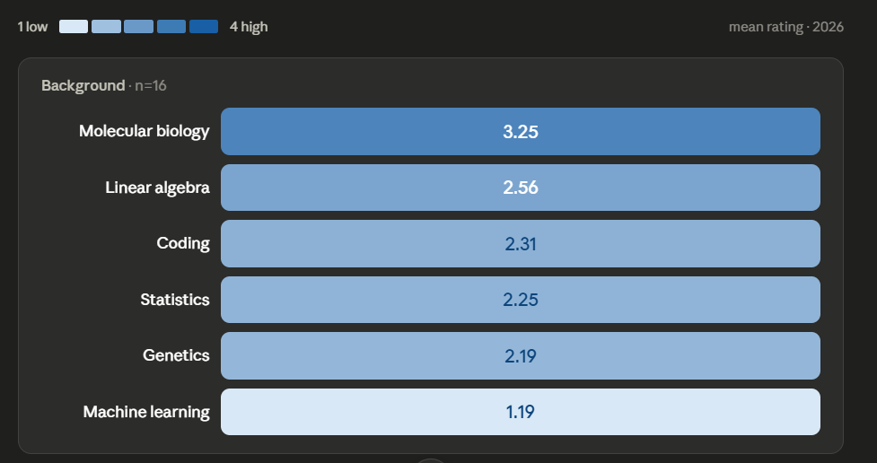
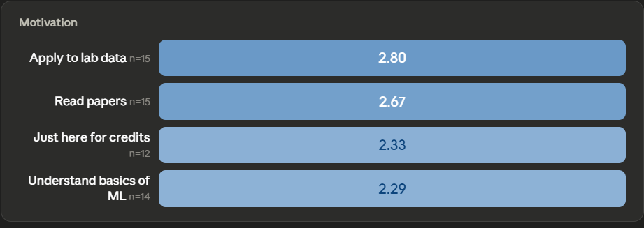
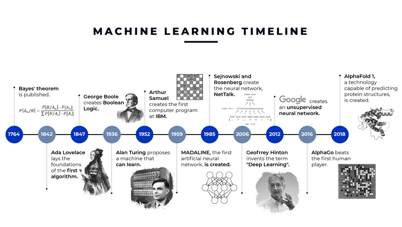
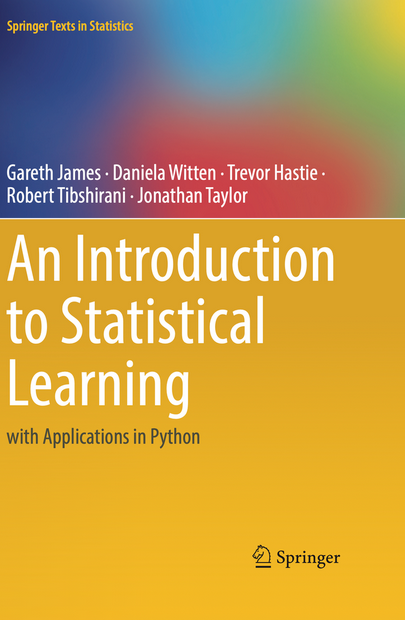
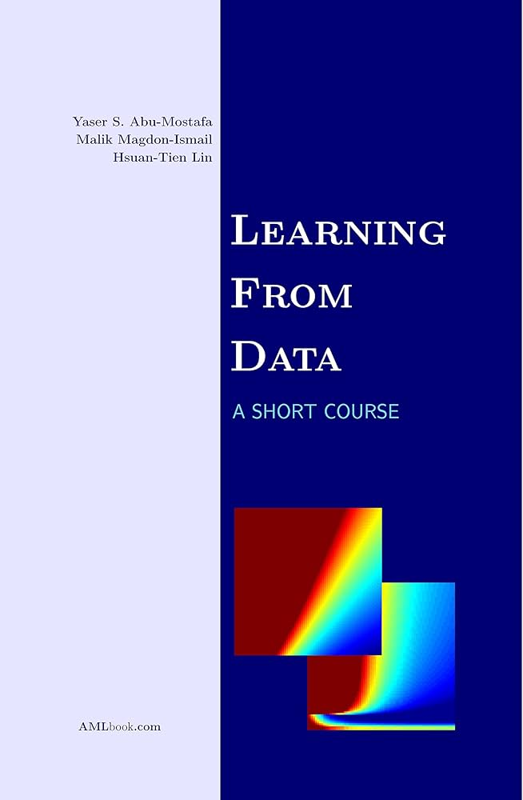
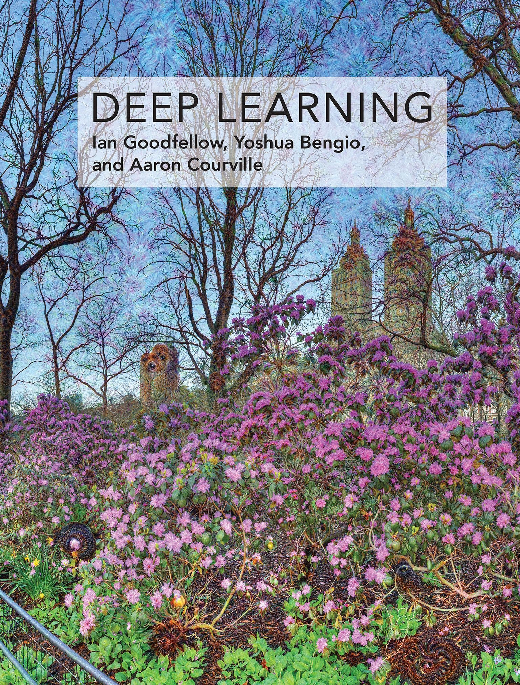
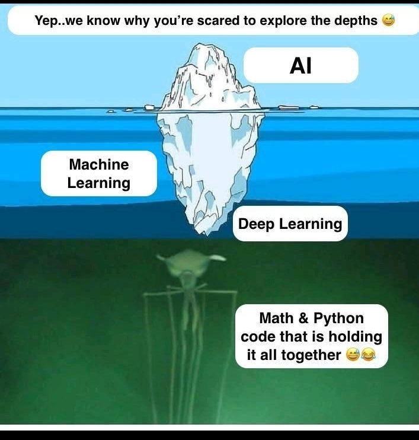

## Agenda {data-name="Intro"}
1. About the course & tutorial goals
2. About you (survey) & about me
3. Homework, project & grading
4. Making the most of it: challenges, LLMs, getting help

## About the course 
::: incremental
- Intro to Machine Learning (ML) and Deep Learning (DL)
- 4 Weeks, Frontal
- Paper-driven teaching
- 2 HWs and a final project (Not included in the Exam)
:::

::: {.notes}
- Demystify ML/DL
- Very short, only 4 weeks, but very intensive. not enough time to make corrections.
- The presentations are not meant to be a replacement for the tutorials. They are a teaching aid for the TA and are available for you on the moodle site to use if you wish.
- No "question and answer" model, but rather a "open problem solving" model.
:::

## Tutorials Goals: [YES]{style="color:green;"}
::: incremental
* **Learn:** concepts in Machine and Deep learning (ML/DL)
* **Understand:** Data driven publications (some)
  + How to read the docs (software documentation)
  + How to leverage LLMs (Large Language Models)
* **Implement:** methods described in literature to solve real-lab problems
* **Evaluate:** modeling results
* **Report:** your findings in a clear and concise manner
:::

::::{.notes}
concepts such as supervised learning, unsupervised learning, reinforcement learning, neural networks, and deep learning architectures.
:::

## Tutorials Goals: [NO]{style="color:red;"}
* **Code:** from scratch
* tools, libraries (pytorch, pandas, scikit-learn), software or frameworks

:::{.footer}
(I'm here to help, but they are not the main focus of the course)
:::

## About the Students: Background 

## About the Students: Motivation

## But Mattan...

::: {.r-fit-text style="text-align:center;"}
This is biotechnology, not computer Science
:::

## About the TA (me)  {.smaller}

**Mattan Hoory**

::: {.column width="60%"}
- *Past life*: QA → Developer (C-linux)  
- *Plot twist*: B.Sc. in CS (Bioinformatics Track)
  + *iGEM* 2022 · *National Taiwan University* exchange  
- *Now*: M.Sc. candidate in Prof. Roee Amit's lab
- Courses I liked: Organic Chemistry, Labs (Genetics/Biomol), this one!
- Passions: food, travel, history and languages!
:::

::: {.column width="30%"}

:::

## Course History
Spring 2025: first time this part of the course is taught

Spring 2026: second time, first time with HW2/Project Split

{width=110%}

## Course Resources {.smaller}
- *Learning from Data: A Short Course*, Y. Abu-Mostafa (Caltech), M. Magdon-Ismail (RPI), H.-T. Lin (NTU)
- *Introduction to Statistical Learning*, G. James, D. Witten, T. Hastie, R. Tibshirani ([link](https://www.statlearning.com/))
- *Deep Learning*, I. Goodfellow, Y. Bengio, A. Courville
- **ONLINE**

::: {.column width="30%"}

{height="300px"}

:::

::: {.column width="30%"}

{height="300px"}

:::

::: {.column width="30%"}

{height="300px"}

:::

## Homework & Grading {data-name="Homework"}
In each assignment, we will implement methods based on a publication, evaluate it, and report our findings.

Submission is **in pairs**, sophisticated libraries not allowed (Ask)

- HW total (35%): HW 1+2 (10%), final project: (25%)

### Grading Breakdown of each HW:
- **Report** (80%):
  + Results (40%) / Explanation & Insight (40%)
-  **Performance** (up to 20%) 🏆 
- **Bonus Points** (Optional)
- **Penalties**

::: {.notes}
NO CHEATING
NO LYING
NO PLAGIARISM
write the final solutions alone and understand them fully
:::

## Course Schedule {.smaller}

| Date         | Wk (ML)           | Topic                          | HW Released                            | HW Due                 |
| ------------ | ----------------- | ------------------------------ | -------------------------------------- | ---------------------- |
| Sun 28.06.26 | 12 (ML 1)         | Simple regression models       | **HW1** (Regression)                   | —                      |
| Sun 05.07.26 | 13 (ML 2)         | fully-connected neural network | **HW2** (Fully-Connected)              | —                      |
| Sun 12.07.26 | 14 (ML 3)         | CNNs                           | —                                      | **HW1**                |
| Sun 19.07.26 | 15 (ML 4)         | Base-calling + Transformers    | **Final Project** (CNN + Transformers) | —                      |
| Sun 26.07.26 | —                 | — _(exam period starts)_       | —                                      | **HW2**                |
| Wed 09.09.26 | —                 | —                              | —                                      | **Final Project**      |

## Course Tips {data-name="Tips"}
+ Programming, Linear Algebra, New terminology - No need to understand all the underlying math to implement deep learning models.
+ Semi-Heavy workload (**2**xHws + **1**xProject) - Start early
+ Keep a notebook (digital and physical) where you translate complex definitions into your own words.
+ TMI

:::{.notes}
troubleshoot my way through new technical challenges with Google and our dear chatbots (e.g. ChatGPT and Copilot).

didn’t need to understand all the underlying math to implement deep learning models.

you can get by without breaking down every equation. If you understand the math, great! You may have better intuition for what’s happening under the hood. If it’s overwhelming, don’t let that stop you. Implement tutorials, and over time, you’ll grasp the concepts that matter for your work.

What helped me was keeping a notebook (digital and physical) where I translated complex definitions into my own words. 

Use Chrome bookmarks to save blog posts that explain things in a way that clicks. The more you immerse yourself, the more familiar these terms will become. Whatever you do, don’t let the initial unfamiliarity paralyse you. There was probably a time when limited resources were a problem. Now, we have the opposite issue: too much information.

HW - start early
:::

## ChatGPT, Gemini and Claude (and other LLMs)
- Code responsibility: you are responsible for the code you submit.
- Tutor, not replacement 
- Can't really really see your results
- Required to submit conversation with LLMs (if used) as part of the HW submission

## How to get and ask for help
- **Moodle forum** is the best way to get help, emails regarding HW will **not** be answered.
- TA hours and workshops available on demand.
  - won't debug line-by-line, but I'll help you get unstuck
- If I speak too fast or too slow - please let me know.
- Ask questions during/after the tutorials
- My email: [hoory@campus.technion.ac.il](mailto:hoory@campus.technion.ac.il)

## How to survive the course
* Independent learning, but also asking for help when needed
* Google and Claude are your friends but also enemies
* Working with your actual friends

::: {.incremental}
1. Examine and understand the data
2. Plan a model pipeline, only then start coding
3. Run the code, and then debug it
4. Repeat
:::
## See you in the forum
{.absolute left=0 right=0 bottom=0 top=120 height="80%" style="margin: auto auto;"}