::: {.center}
# 1 Intro
:::

## 1.1 HW1 Out (One Week Left)
{fig-align="center" width=50%}

- Due Date: 12.7
- Use the forum & workshops (Tue. 14:00, Thu. 18:00) to ask questions

::: {.center}
# 2 Tutorial 1 recap {data-name="Recap"}
:::

## 2.1 Basic notations of ML
::: {.columns}

::: {.column width="50%"}
| Symbol |
| --- |
| $\mathcal{X}$ |
| $\mathcal{Y}$ |
| $D = \{(x_i, y_i)\}_{i=1}^N$ |
| $f: \mathcal{X} \to \mathcal{Y}$ |
| $\mathcal{A}$ |
| $\mathcal{H}$ |
:::

::: {.column width="50%"}
| Symbol |
| --- |
| $h_{\theta^*} \approx f$ |
| $\mathcal{L}(h_\theta)$ |
| $\theta$ |
| $\eta$ |
| $\nabla_\theta \mathcal{L}(h_\theta)$ |
:::

:::

## 2.2 Model training workflow:
::: {.incremental}
1. Prepare data $D$
2. Choose model $\mathcal{H}$
3. **Train model:** Find $h_{\theta^*}$ s.t. $\mathcal{L}(h_{\theta^*}) = \displaystyle\min_{h_\theta \in \mathcal{H}} \mathcal{L}(h_\theta)$
   - Loss function
   - Optimization algorithm
4. **Tune hyperparameters:** Use validation set
5. **Evaluate:** Assess performance on test set
6. **Deploy:** Use trained model ($h_\theta$) for predictions
:::

## 2.3 Gradient Descent (GD)

1. Initialize $\theta$
2. Repeat:
    - Compute gradient $\nabla_\theta \mathcal{L}(\theta)$
    - Update: $\theta \leftarrow \theta - \eta \nabla_\theta \mathcal{L}(\theta)$
3. Until convergence

## 2.4 Linear Regression (LR)
1. **Model:** $h_\theta(x) = \theta^T x$
2. **Loss function:** $\mathcal{L}(h_\theta) = \frac{1}{2} \sum_{i=1}^N (y_i - h_\theta(x_i))^2$
3. **Optimization:** Find $\theta^*$ that minimizes $\mathcal{L}(h_\theta)$
   - Gradient descent: Iteratively update $\theta$ using the gradient of the loss function

## 2.5 Example: 1D LR loss function

:::{.columns}
::: {.column width="50%"}
<div style="text-align: center;">
  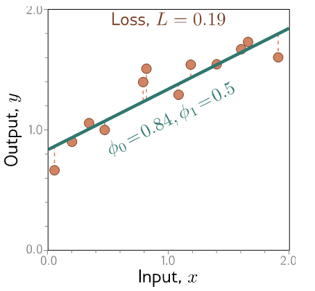
</div>
:::

::: {.column width="40%"}
<div style="text-align: center;">
  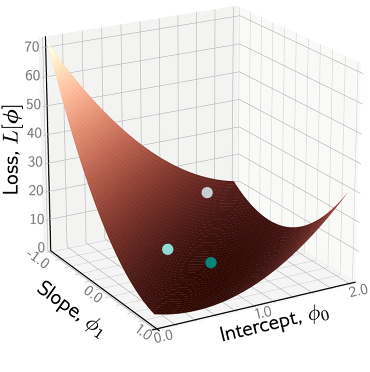
</div>
:::
:::

## 2.5 Example: 1D LR loss function
<div style="text-align: center;">
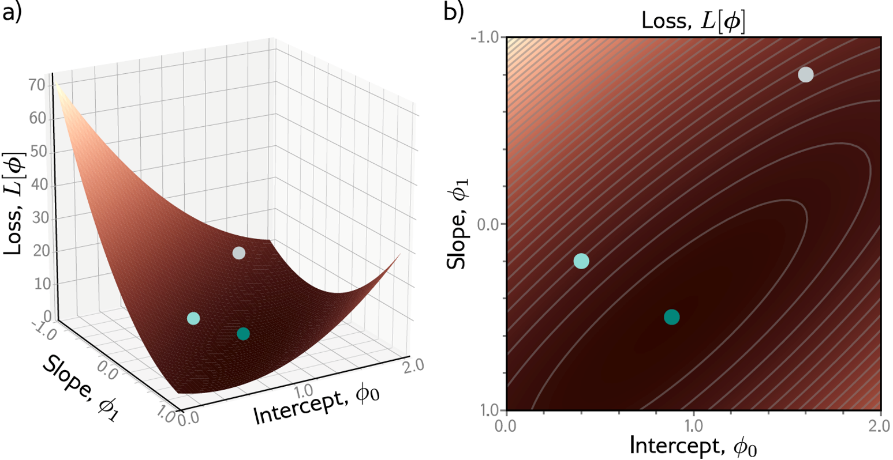
</div>


## 2.5 Example: 1D LR loss function
<div style="text-align: center;">

::: {.r-stack}

{.fragment}

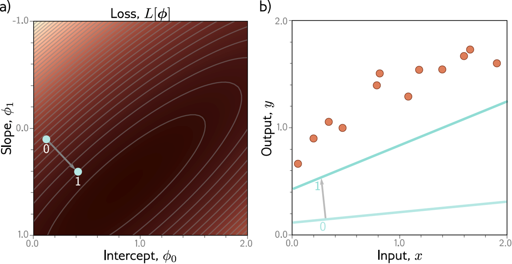{.fragment}

{.fragment}

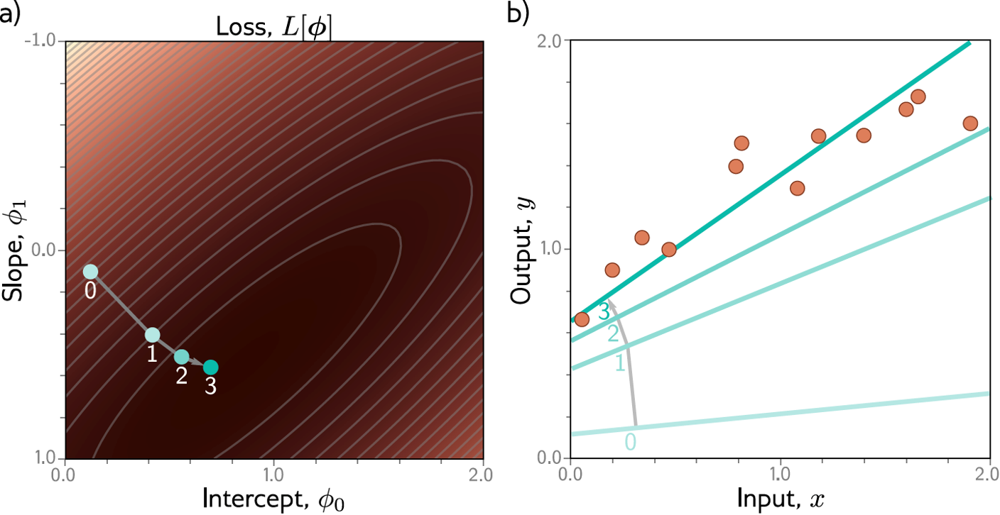{.fragment}  

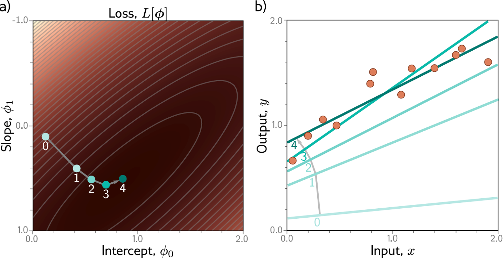{.fragment}

:::
</div>

## 2.6 Overfitting
<div style="text-align: center;">
{width=90%}
</div>

## 2.6 Overfitting
<div style="text-align: center;">
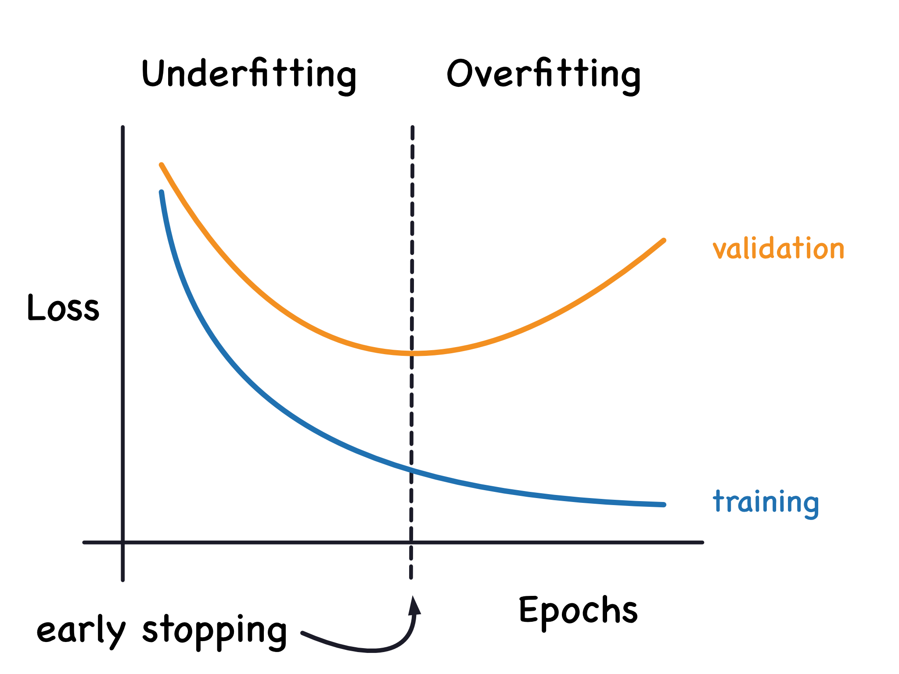{width=90%}
</div>

## 2.7 The perceptron: 1D LR as a shallow network
<div style="text-align: center;">
{fig-align="center" width=70%}

$\hat{y}=\begin{cases}1 & w^T\cdot x + b \ge 0\\0 & w^T\cdot x + b < 0\end{cases}$
</div>

## 2.8 Possible problems with linear models
::: {.incremental}
1. Want to be able to describe non-linear relationships
2. Want multiple inputs
3. Want multiple outputs
:::


::: {.center}
# 3 Perceptron → Multi-Layered Perceptron (MLP) {data-name="Perceptron"}
Graphics from 236781 Deep learning course at the Technion (Dr. Haim Baskin)
:::

## 3.1 Piecewise linear functions
Consider the following function we would like to learn:
<div style="text-align: center;">
::: {.r-stack}

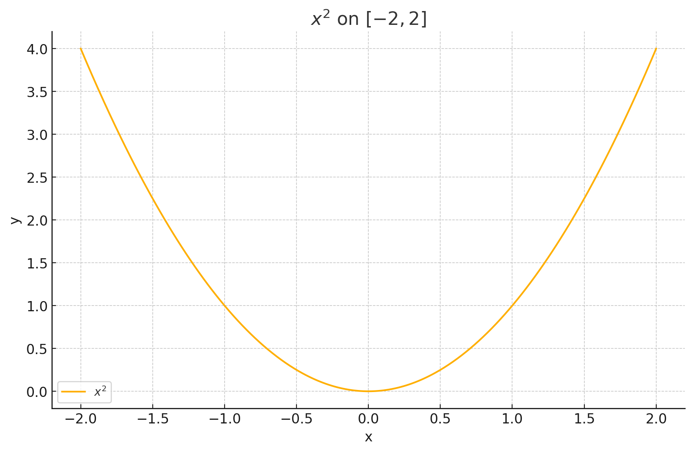{.fragment width=70%}

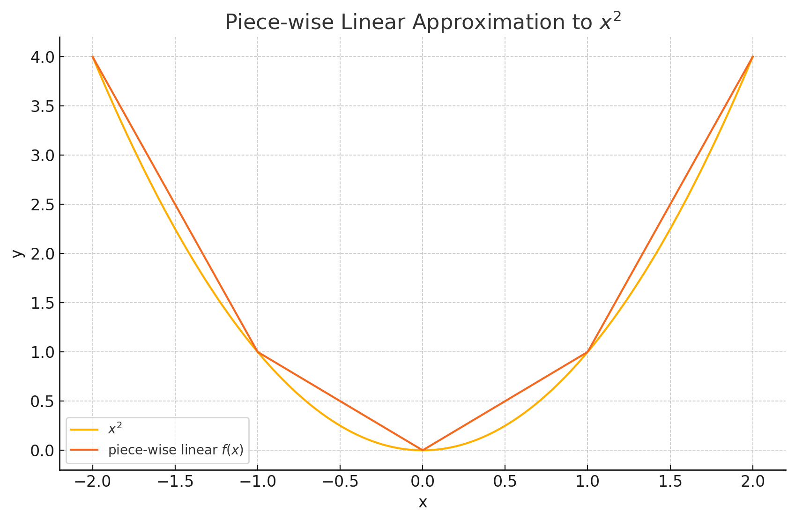{.fragment width=70%}

:::
</div>

## 3.1 Piecewise linear functions{.smaller}

::: {.columns}
::: {.column width="40%"}
<div style="text-align: center;">
  
</div>
:::
::: {.column width="20%"
}
$$
f(x)=
\begin{cases}
-3x-2,&-2\le x\le -1\\
-x,&-1<x\le 0\\
x,&0<x\le 1\\
3x-2,&1<x\le 2
\end{cases}
$$
:::
:::

::: {.incremental}
- Combinatorical
  - Number of regions in the function: 4
  - Location of joints: $-1, 0, 1$
- Doesnt scale well to higher dimensions
- Differentiablity?
:::

## 3.2 Activation functions: learnable joints!
$\text{ReLU} = \max(0, f(x))$ (Rectified Linear Unit)
$$
\operatorname{ReLU}(f(x)) =
\begin{cases}
0, & f(x) < 0 \\
f(x), & f(x) \ge 0
\end{cases}
$$
<div style="text-align: center;">

<iframe src="https://www.desmos.com/calculator/ap5gwdoznu" width="1080" height="420" style="border: 1px solid #ccc" frameborder=0></iframe>

</div>

## 3.3 Pass through ReLU functions: hidden units
<div style="text-align: center;">
  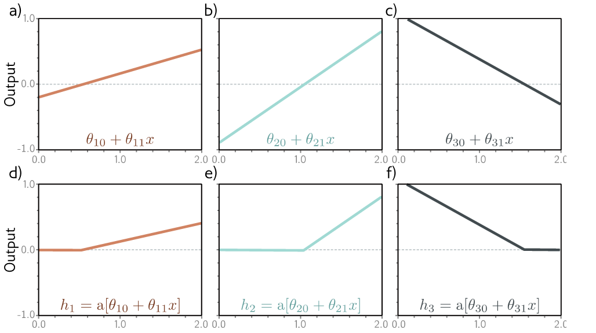{width=60%}
</div>
 - Other activation functions: sigmoid, tanh, softmax, etc.

## 3.4 Weight the hidden units
<div style="text-align: center;">
  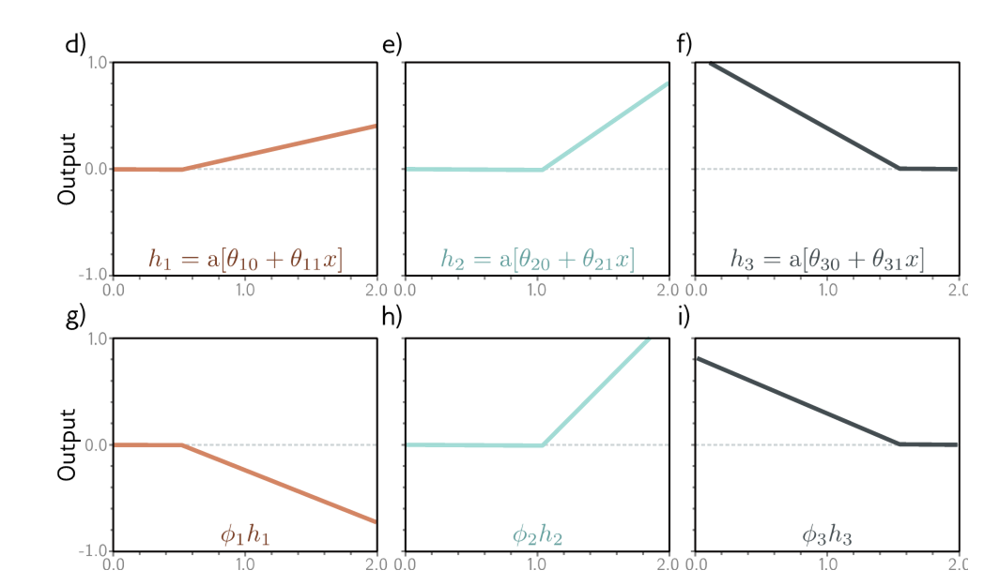
</div>

## 3.5 Sum the weighted hidden units to output
<div style="text-align: center;">
  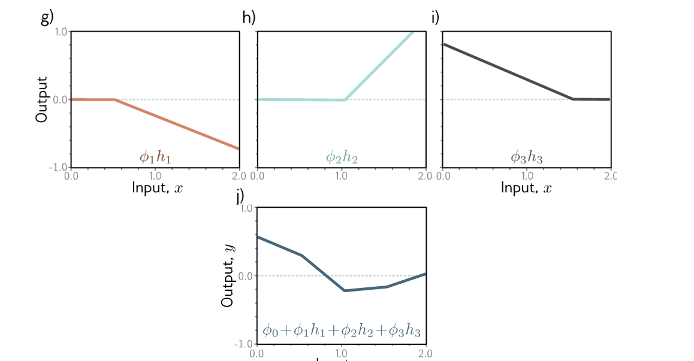
</div>

## 3.6 Lets draw the network again
<div style="text-align: center;">
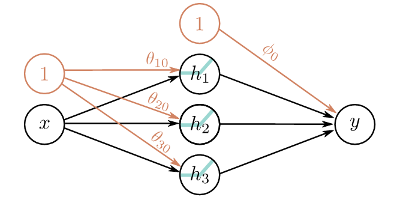
</div>  
$$
\begin{aligned}
y &= \phi_0 
+ \phi_1\, \mathrm{ReLU}\left(\theta_{10} + \theta_{11} x\right) \\
&\quad + \phi_2\, \mathrm{ReLU}\left(\theta_{20} + \theta_{21} x\right) \\
&\quad + \phi_3\, \mathrm{ReLU}\left(\theta_{30} + \theta_{31} x\right)
\end{aligned}
$$

## 3.7 Multiple inputs
* 2 inputs, 3 hidden units, 1 output
<div style="text-align: center;">
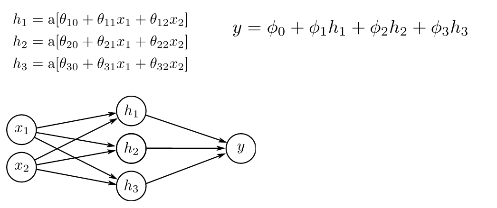
</div>

## 3.8 Multiple outputs

- 1 input, 4 hidden units, 2 outputs
<div style="text-align: center;">
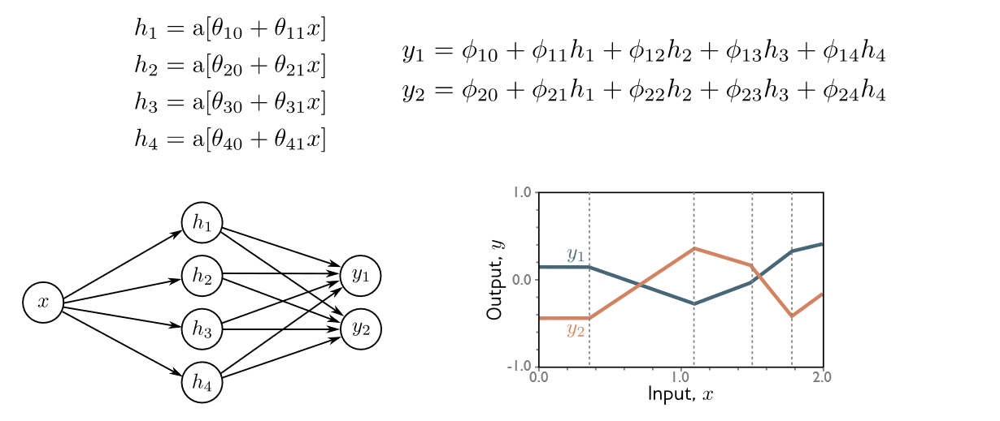
</div>

## 3.9 Question

- How many parameters does this model have?
<div style="text-align: center;">
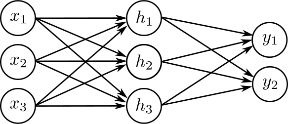
</div>

## 3.10 Nomenclature {.smaller}
<div style="text-align: center;">
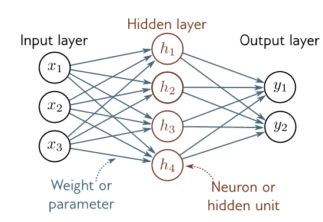{width=45%}
</div>
* Everything in one layer connected to everything in the next = fully connected network 
* No loops = feedforward network
* Values after ReLU (activation functions) = activations
* One hidden layer = shallow neural network

## 3.11 MLP: Deep networks {.smaller}
<div style="text-align: center;">
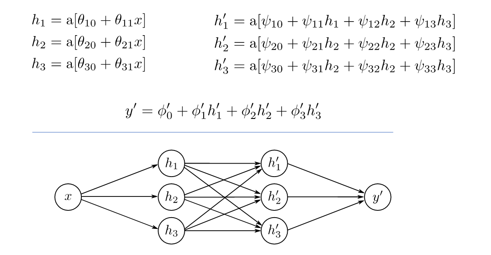{width=80%}
</div>

- **Depth:** number of hidden layers (Hyperparameter)
- **Width:** number of hidden units per layer (Hyperparameter)

## 3.12 Intuition: Folding {.smaller}
<div style="text-align: center;">
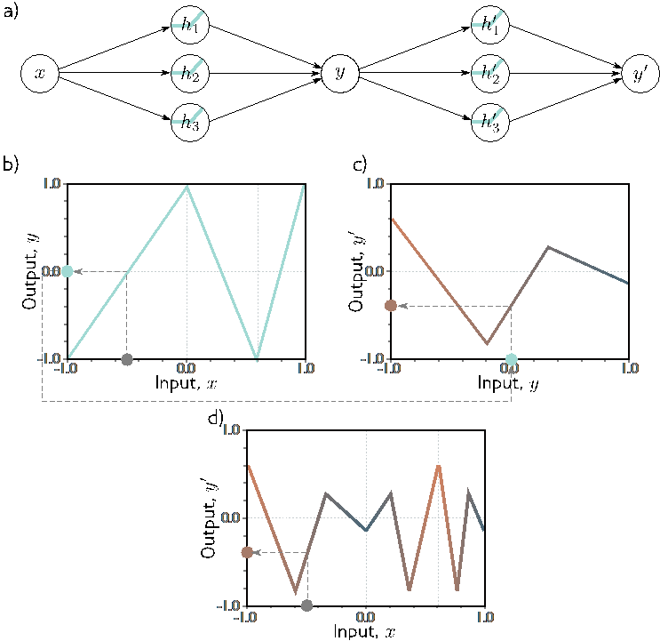{width=58%}
</div>

## 3.13 Shallow VS Deep {.smaller}
<div style="text-align: center;">
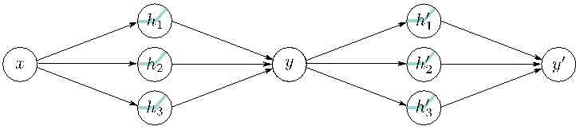{width=45%}
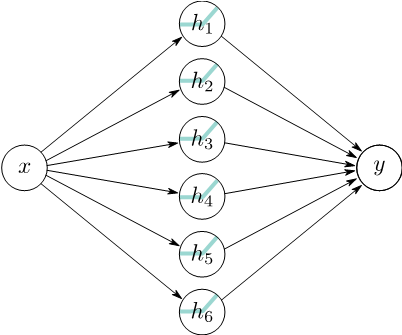{width=45%}
</div>
- Shallow: 19 parameters, max 7 regions
- Deep: 20 parameters, at least 9 regions

## 3.14 Shallow VS Deep viusalized
<div style="text-align: center;">
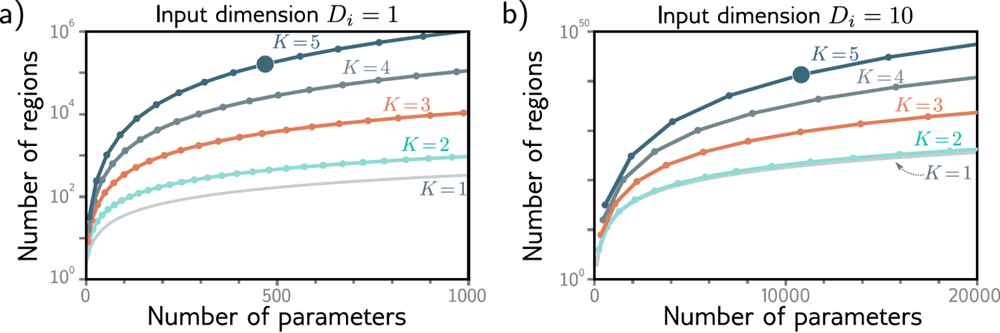
</div>
- K: Number of hidden layers

## 3.15 Notations
::: {.fragment}
$$
\mathbf{h} =
\mathbf{a}
\left(
\begin{bmatrix}
\theta_{10} \\
\theta_{20} \\
\theta_{30}
\end{bmatrix}
+
\begin{bmatrix}
\theta_{11} \\
\theta_{21} \\
\theta_{31}
\end{bmatrix}
x
\right)
= \mathbf{a}(\boldsymbol{\theta}_0 + \boldsymbol{\theta} x)
$$
:::

::: {.fragment}
$$
\mathbf{h}' =
\mathbf{a}
\left(
\begin{bmatrix}
\psi_{10} \\
\psi_{20} \\
\psi_{30}
\end{bmatrix}
+
\begin{bmatrix}
\psi_{11} & \psi_{12} & \psi_{13} \\
\psi_{21} & \psi_{22} & \psi_{23} \\
\psi_{31} & \psi_{32} & \psi_{33}
\end{bmatrix}
\begin{bmatrix}
h_1 \\
h_2 \\
h_3
\end{bmatrix}
\right)
= \mathbf{a}(\boldsymbol{\psi}_0 + \boldsymbol{\Psi} \mathbf{h})
$$
:::

::: {.fragment}
$$
y =
\begin{bmatrix}
\phi_1 & \phi_2 & \phi_3
\end{bmatrix}
\begin{bmatrix}
h_1' \\
h_2' \\
h_3'
\end{bmatrix}
+ \phi_0
= \boldsymbol{\phi}^\top \mathbf{h}' + \phi_0
$$
:::
## 3.16 Deep networks
<div style="text-align: center;">

</div>

## 3.16 Deep networks
<div style="text-align: center;">
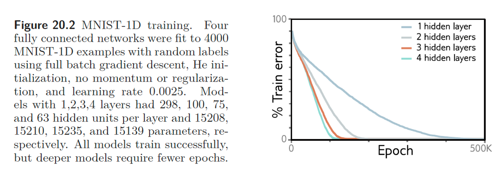
</div>

## 3.17 Deep Neural Network playground
<iframe src="https://playground.tensorflow.org/" width="1280" height="720" style="border: 1px solid #ccc" frameborder=0></iframe>

::: {.notes}
- Gaussian - LR, No Activation.
  - Can add noise
- XOR - LR Fails, ReLU works (1,2,3 hidden units)
- Spiral - 4x8
:::


::: {.center}
# 4 Backpropagation {data-name="Backpropagation"}
How do we find $\nabla \mathcal{L}(h_\theta)$ for deep networks?
$$L'(\theta,\psi,\phi) = ... ?$$
:::

## 4.1 Chain rule (1-D recap)

> If $y = f(g(x))$  
> and $u = g(x)$ then  

$$
\frac{dy}{dx} \;=\;
\frac{dy}{du}\;\frac{du}{dx}.
$$

*One derivative “chain” per link.*


## 4.2 Chain rule example {.smaller}

Let $u=g(x)=x^2,\quad y=f(u)=\sin u,\quad x=0.3$

::: {.incremental}
- In Calculus class:
  - $y=f(g(x))=\sin(x^2)$
  - $f'(x)=\cos(x^2)\cdot 2x = \cos(u)\cdot u'$
- Forward  
  - $u = g(0.3)=0.09,\quad y=f(u)=\sin 0.09\approx 0.0899$  
- Gradients  
  - $\displaystyle \frac{dy}{du}= \cos u=0.996\quad,\quad \frac{du}{dx}=2x=0.6$  
  - $$\frac{dy}{dx} = \frac{dy}{du}\frac{du}{dx} =0.996\times 0.6 \approx 0.598$$
:::

## 4.3 Motivation for backpropagation {.smaller}

Take the toy model:
$$
f(x,y,z)= (x+y)\,z=qz,
\qquad
x,y \xrightarrow{+} q \xrightarrow{\times z} f .
$$

To get every gradient we build three separate chains, what is the problem?

$$
\begin{aligned}
\frac{\partial f}{\partial x} &= 
\frac{\partial f}{\partial q}\;
\frac{\partial q}{\partial x}
     = z\cdot 1 = z \\[6pt]
\frac{\partial f}{\partial y} &= 
\frac{\partial f}{\partial q}\;
\frac{\partial q}{\partial y}
     = z\cdot 1 = z \\[6pt]
\frac{\partial f}{\partial z} &= 
     \frac{\partial f}{\partial z}
     = q
\end{aligned}
$$

## 4.4 Backpropagation {.smaller}
- We need to compute the gradient of the loss function with respect to each parameter in the network. $\frac{\partial L}{\partial \theta}, \frac{\partial L}{\partial \psi}, \frac{\partial L}{\partial \phi}$
- Use the chain rule to compute gradients efficiently by reusing intermediate results from the forward pass.

<div style="text-align: center;">
{width=80%}
</div>

## 4.5 Backpropagation example {.smaller}
$$
f(x,y,z)= (x+y)\,z=qz,
\qquad
x,y \xrightarrow{+} q \xrightarrow{\times z} f .
$$

- Let $x=-2, y=5, z=-4$. Need $\frac{\partial f}{\partial x}, \frac{\partial f}{\partial y}, \frac{\partial f}{\partial z}$

<div style="text-align: center;">
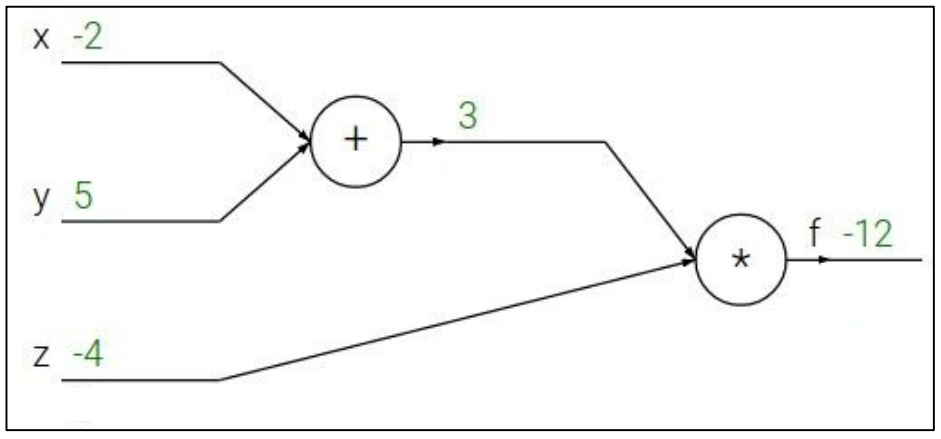{width=80%}
</div>

## 4.6 Backprop algorithm (simplified)
1. Build the computational graph
2. Forward pass: compute all intermediate values
3. Backward pass: compute gradients (once!) using the chain rule
4. Update parameters using gradients


::: {.center}
# 5 Implementing and training models {data-name="Practice"}
:::

## 5.1 Defining the model
```pseudo
W1 =  HeNormal([h1_dim, in_dim])     # weight matrix
b1 =  zeros([h1_dim, 1])

W2 =  HeNormal([h2_dim, h1_dim])
b2 =  zeros([h2_dim, 1])

W3 =  HeNormal([out_dim, h2_dim])
b3 =  zeros([out_dim, 1])

forward(X):
  z1 = W1 @ X + b1
  a1 = ReLU(z1)

  z2 = W2 @ a1 + b2
  a2 = ReLU(z2)

  z3 = W3 @ a2 + b3
  ŷ  = z3                              
```

## 5.2 The deep learning training loop
```pseudo
import loss_function, SGD, backprop, forward

optimizer = SGD(learning_rate=0.01)

for epoch in range(num_epochs):
  optimizer.zero_grad()

  # Forward pass
  Y_hat = forward(X)
  loss = loss_function(Y_hat, Y)

  # Backward pass
  gradients = backprop(loss, W1, b1, W2, b2, W3, b3)

  # Update parameters
  optimizer.step(gradients)
```