::: {.center}
# 1 Intro
:::

## 1.1 משאל המרצה והמתרגל
Open now! We would love to hear your feedback on the course and the tutorials.

{fig-align="center" width=40%}

## 1.2 Today's plan
- **Images with CNNs**: convolution, filters, pooling, and why they beat fully connected networks on images.
- **From images to sequences**: how the same ideas power the CNN in your **final project** (RNA-protein binding).
- **Where this goes next**: residual connections and U-Net (enrichment).
- **Code**: LeNet, and the final-project CNN training loop.

::: {.center}
# 2 Tutorial 2 recap {data-name="Recap"}
Deep Neural Networks + Backpropagation
:::

## 2.1 Deep neural networks
- Example: classify if an image is "5" or "6"
<div style="text-align: center;">
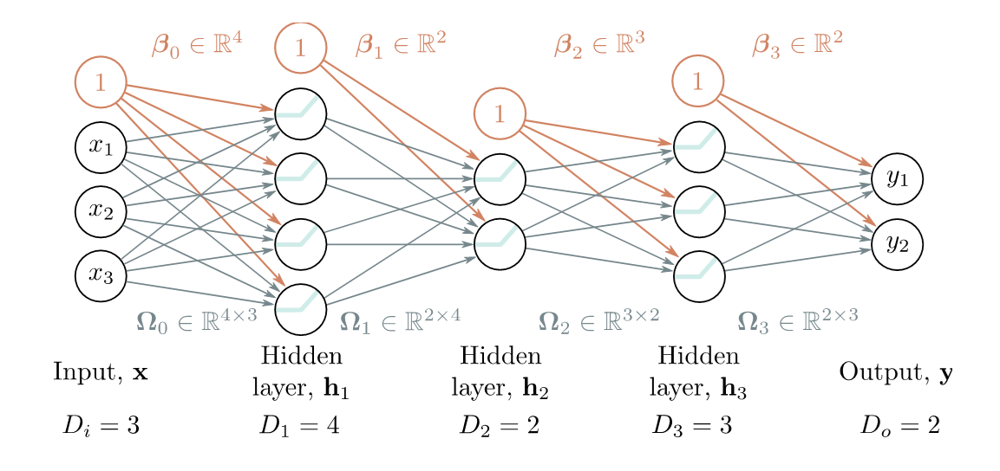
</div>

## 2.2 Backpropagation
- Used to compute gradients and update weights in neural networks.
- Example (MSE): $\mathcal{L} = \frac{1}{N} \sum_{i=1}^N (y_i - \hat{y}_i)^2$
<div style="text-align: center;">
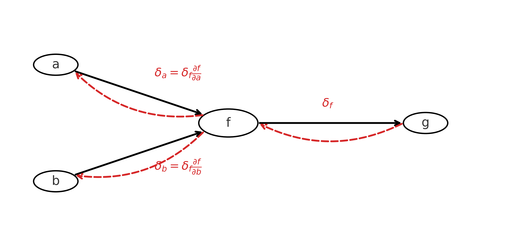
</div>

## 2.3 Training a network - Almost :)

```{.python style="font-size: 1.2em;" code-line-numbers="|4,5,6,7,8|10|11|12|13|14|15|16|17"}
import SGD
import MSE

def model(x):                    # x = one input vector
    a1 = relu(W1 @ x  + b1)      # input  -> hidden layer 1
    a2 = relu(W2 @ a1 + b2)      # hidden -> hidden layer 2
    y  =      W3 @ a2 + b3       # hidden -> output (linear)
    return y

def train(model, data, num_epochs=10):
    for epoch in range(num_epochs):
        for x, y in data:
            SGD.zero_grad()
            y_hat = model(x)
            loss = MSE(y_hat, y)
            loss.backward()
            SGD.step()
```


::: {.center}
# 3 Convolutional Neural Networks (CNN) {data-name="CNN"}
Slides based on 236781 Deep learning course at the Technion (Dr. Haim Baskin)
:::

## 3.1 Representing images as tensors
- Images are represented as 3D tensors (height, width, channels)
- Each pixel is represented by a value (e.g., grayscale) or multiple values (e.g., RGB channels)
<div style="text-align: center;">
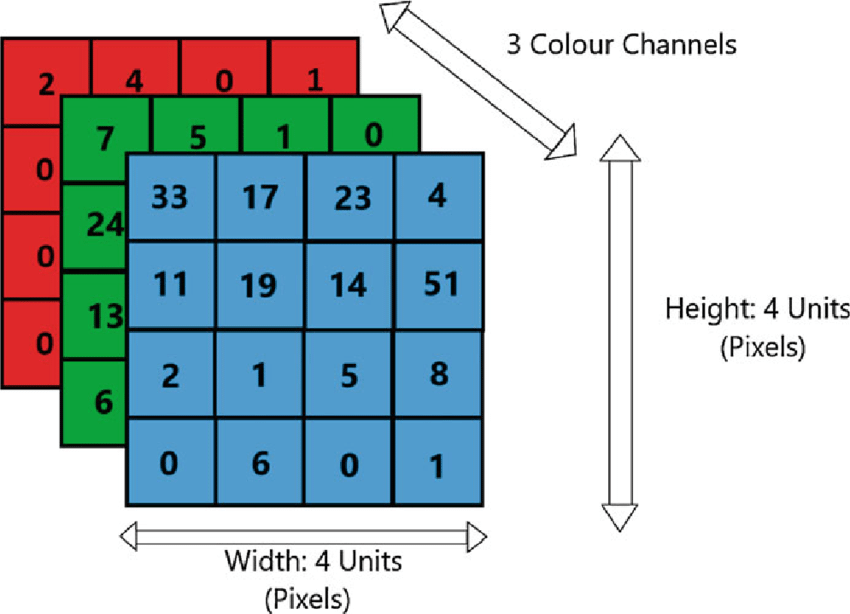{fig-align="center" width=45%}
</div>

## 3.2 Flattening an image
<div style="text-align: center;">
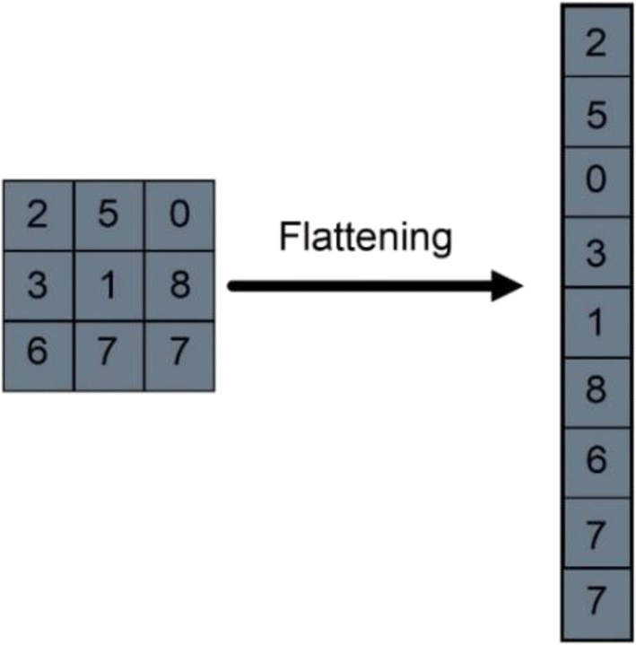{fig-align="center" width=45%}
</div>

## 3.3 Images and DNNs {.smaller}
- Deep neural networks (fully connected) connect each neuron to **every** pixel in the input image.
- Possible issues?

<div style="text-align: center;">
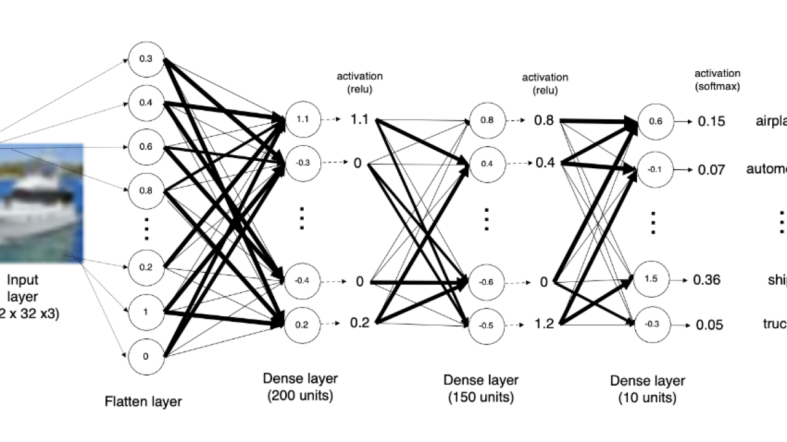{fig-align="center" width=60%}
</div>

::: {.notes}
- Fully connected networks struggle with high-dimensional data like images due to the large number of parameters - Nearby pixels statistically related
  - 224x224 RGB image = 150,528 dimensions
:::

## 3.4 Convolution in 1D
Convolution* in 1D
- Input vector x:

$$
\mathbf{x}=\left[x_1, x_2, \ldots, x_I\right]
$$

- Output is weighted sum of neighbors:

$$
z_i=\omega_1 x_{i-1}+\omega_2 x_i+\omega_3 x_{i+1}
$$

- Convolutional kernel or filter:

$$
\boldsymbol{\omega}=\left[\omega_1, \omega_2, \omega_3\right]^T
$$

Kernel size $=3$

## 3.5 Convolution in 1D example
<div style="text-align: center;">
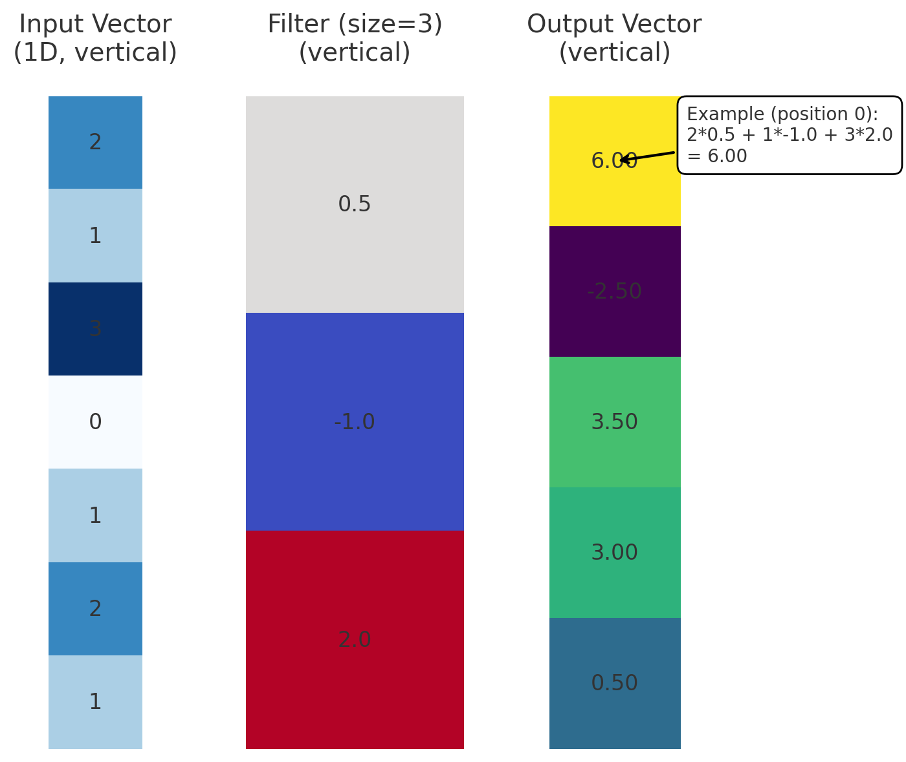{fig-align="center" width=65%}
</div>

## 3.6 Convolution in 1D (cont.)
- **Parameter sharing**: The same filter is applied across the entire input, reducing the number of parameters.
<div style="text-align: center;">
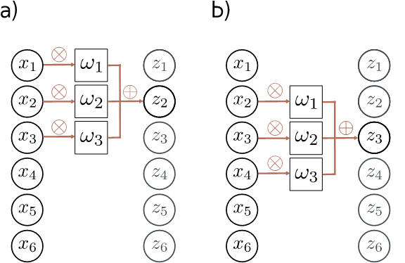{fig-align="center" width=60%}
</div>

## 3.7 Zero padding
- To maintain the same output size as input (not always), we can add zeros around the input vector.
<div style="text-align: center;">
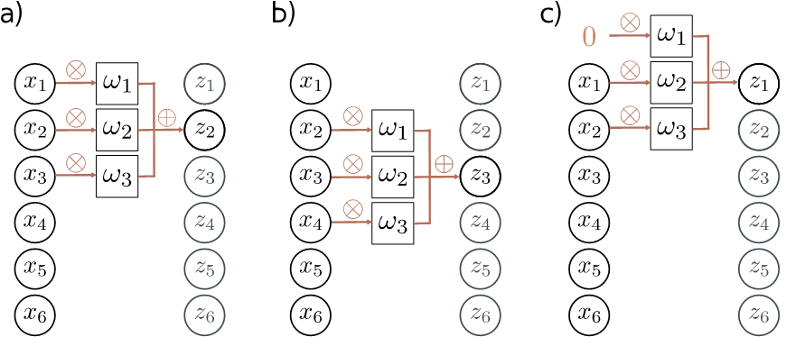{fig-align="center" width=100%}
</div>

## 3.8 Properties of convolutional filters
- **Stride**: shift by k positions for each output
  + Decreases size of output relative to input
- **Kernel size**: weight a different number of inputs for each output
  + Combine information from a larger area
  + But kernel size 5 uses 5 parameters
- **Dilation**: insert zeros between weights
  + Combine information from a larger area
  + Fewer parameters

## 3.9 Stride, Kernel Size, and Dilation
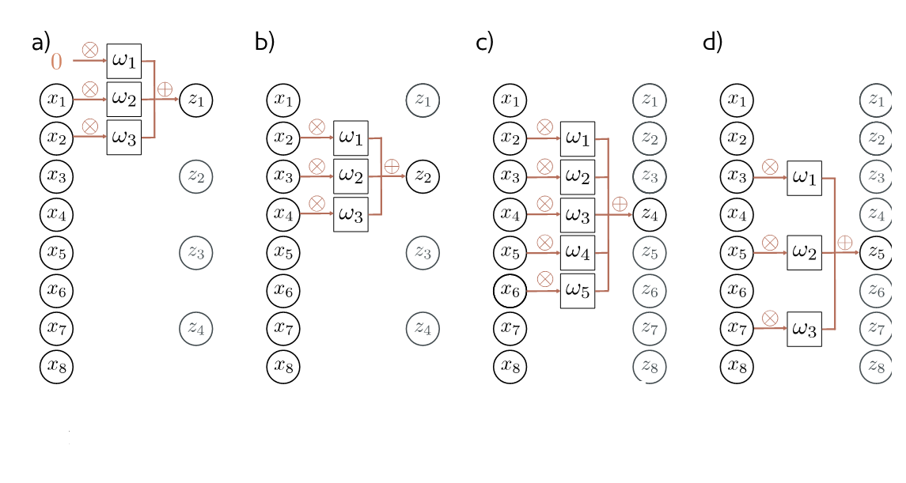{width="100%"}

## 3.9 Stride, Kernel Size, and Dilation
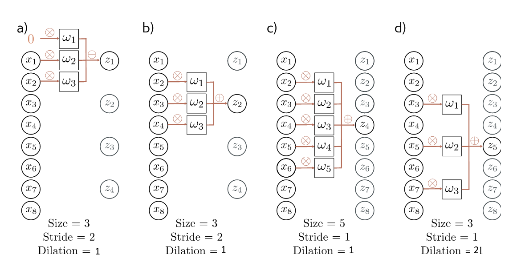{width="100%"}

## 3.10 Fully connected vs. convolutional layers {.smaller}
- Fully connected layers connect every input to every output, leading to a large number of parameters.
- Convolutional layers use filters (kernels) to scan the input, sharing weights across space and reducing the number of parameters.
Convolutional network:

$$
\begin{aligned}
h_i & =\mathrm{a}\left[\beta+\omega_1 x_{i-1}+\omega_2 x_i+\omega_3 x_{i+1}\right] \\
& =\mathrm{a}\left[\beta+\sum_{j=1}^3 \omega_j x_{i+j-2}\right]
\end{aligned}
$$


Fully connected network:

$$
h_i=\mathrm{a}\left[\beta_i+\sum_{j=1}^D \omega_{i j} x_j\right]
$$

## 3.11 Special case of fully-connected network
<div style="text-align: center;">
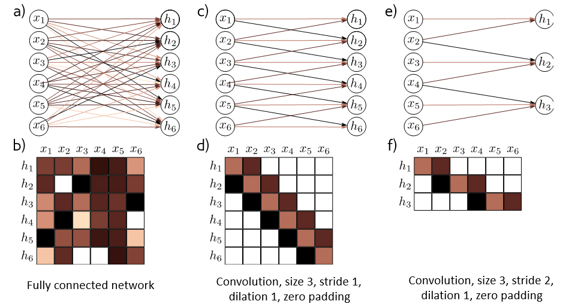{fig-align="center" width=90%}
</div>

## 3.12 Two output channels
- Convolutional layers can have multiple output channels (feature maps).
- Each channel is produced by a different filter.
- Prevents information loss and allows the network to learn different features.
<div style="text-align: center;">
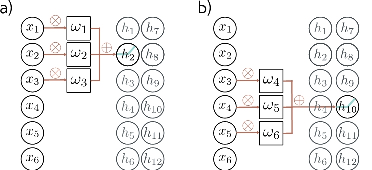{fig-align="center" width=60%}
</div>

## 3.13 Two input channels, one output channel {.smaller}
- Convolutional layers can also handle multiple input channels (e.g., RGB images).
- Each input channel is convolved with its own filter, and the results are summed to produce the output channel.
- This allows the network to learn features from different input channels.
<div style="text-align: center;">
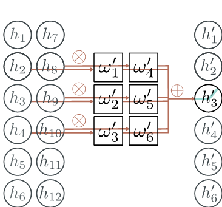{fig-align="center" width=30%}
</div>

## 3.14 How many parameters?
How many parameters?
- If there are $C_i$ input channels and kernel size K

$$
\boldsymbol{\Omega} \in \mathbb{R}^{C_i \times K} \quad \boldsymbol{\beta} \in \mathbb{R}
$$

- If there are $C_i$ input channels and $C_o$ output channels

$$
\boldsymbol{\Omega} \in \mathbb{R}^{C_i \times C_o \times K} \quad \boldsymbol{\beta} \in \mathbb{R}^{C_o}
$$

## 3.15 Receptive fields
- The receptive field of a neuron is the region of the input that affects its output.
<div style="text-align: center;">
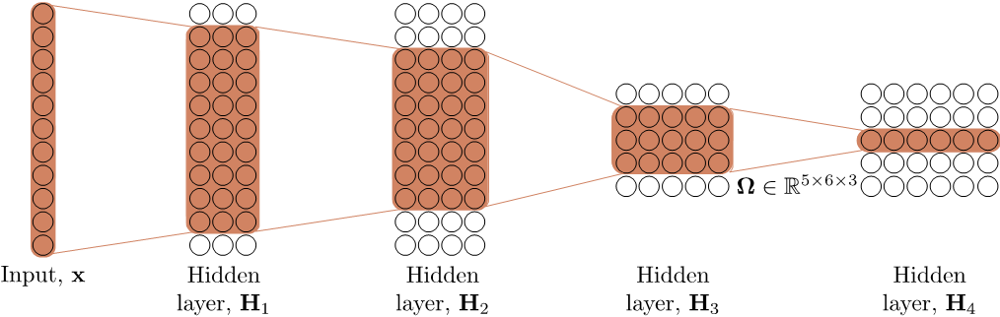{fig-align="center"}
</div>

## 3.16 Classification using CNNs
- Input: image
- Output: probabilities for each class

<div style="text-align: center;">
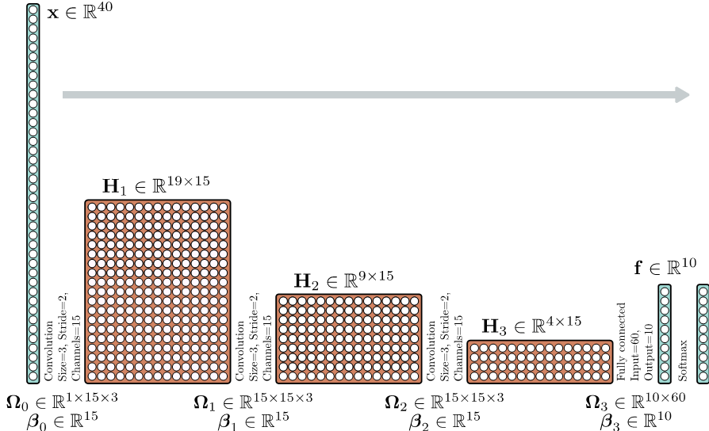{fig-align="center" width=65%}
</div>

## 3.17 Results of classification using CNNs
<div style="text-align: center;">
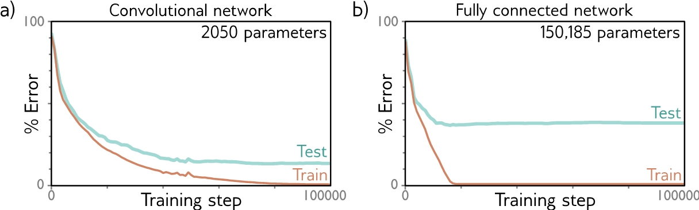{fig-align="center"}
</div>

## 3.18 2D Convolution {.smaller}
- Input image is a 2D matrix, and the filter is also a 2D $K\times K$ matrix.
<iframe src="https://ezyang.github.io/convolution-visualizer/" width="1280" height="520" style="border: 1px solid #ccc" frameborder=0></iframe>

## 3.19 Convolution in 2D example
<div style="text-align: center;">
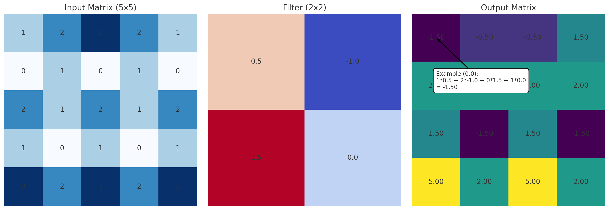{fig-align="center"}
</div>

## 3.20 Number of Parameters in 2D Convolution
- If there are $C_i$ input channels and kernel size $\mathrm{K} \times \mathrm{K}$

$$
\boldsymbol{\omega} \in \mathbb{R}^{C_i \times K \times K} \quad \boldsymbol{\beta} \in \mathbb{R}
$$

- If there are $C_i$ input channels and $C_o$ output channels

$$
\boldsymbol{\omega} \in \mathbb{R}^{C_i \times C_o \times K \times K} \quad \boldsymbol{\beta} \in \mathbb{R}^{C_o}
$$


## 3.21 Channels in 2D Convolution
- Each channel in a 2D convolution corresponds to a different feature map.<div style="text-align: center;">
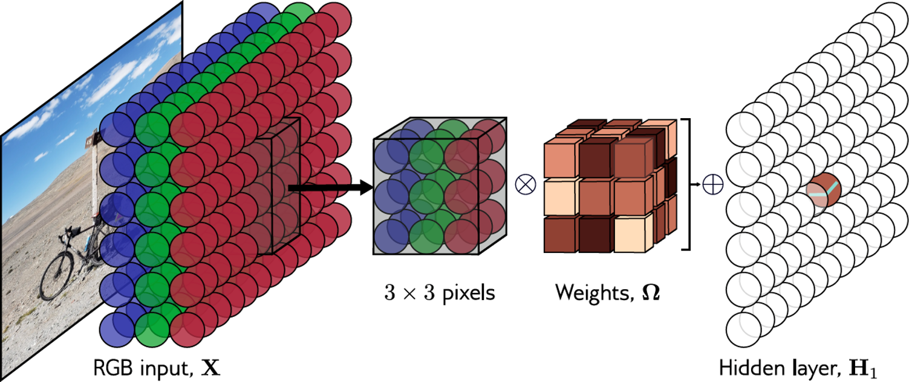{fig-align="center"}
</div>


## 3.22 Pooling
- Pooling layers reduce the spatial dimensions of the input, retaining important features while reducing computational complexity.
- No learnable parameters.

<div style="text-align: center;">
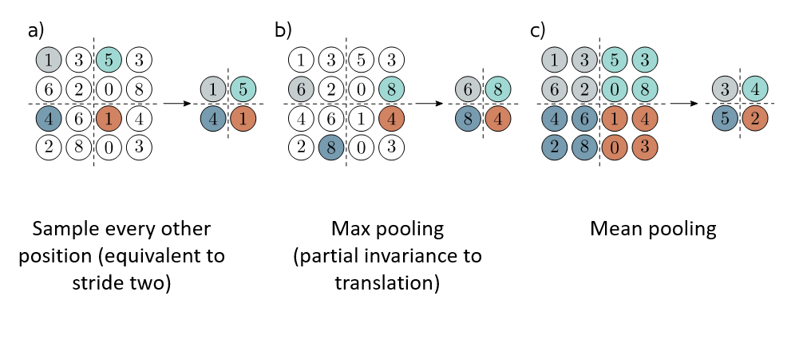{fig-align="center" width="80%"}
</div>

## 3.23 AlexNet (2012)
- One of the first successful CNN architectures

<div style="text-align: center;">
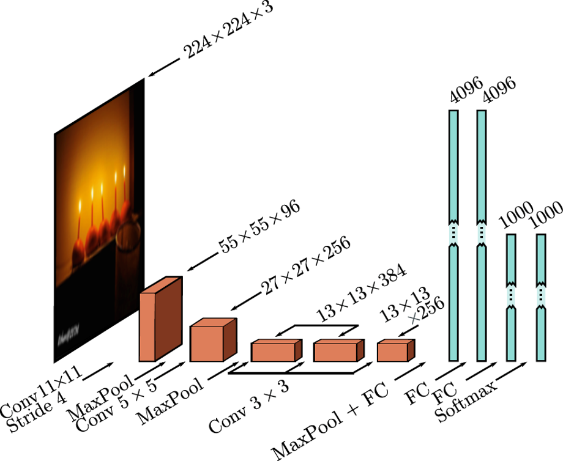{fig-align="center" width="55%"}
</div>

## 3.24 But what does the CNN "see"?
<div style="text-align: center;">
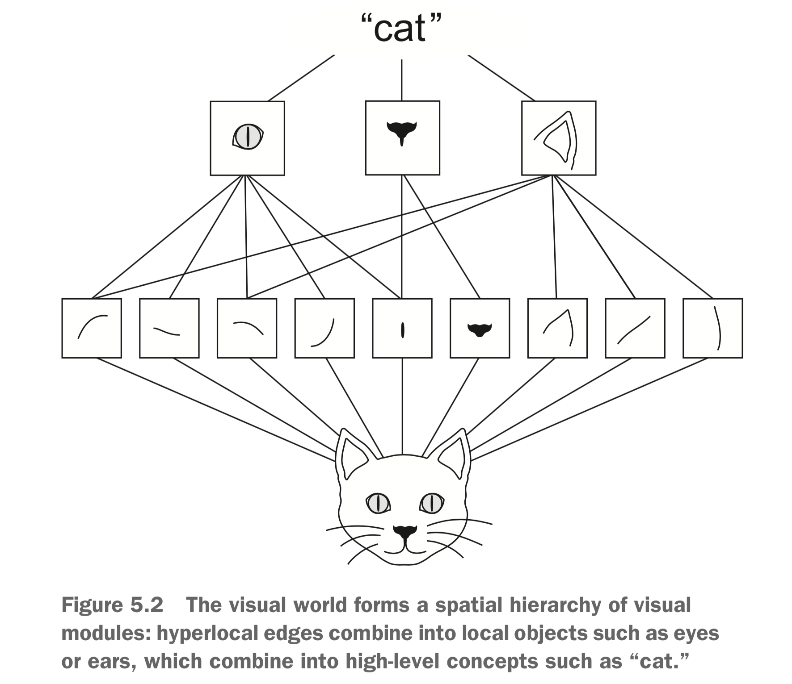{fig-align="center" width="60%"}
</div>

## 3.25 But what does the CNN **really** "see"?
<iframe src="https://adamharley.com/nn_vis/cnn/2d.html" width="1280" height="720" style="border: 1px solid #ccc" frameborder=0></iframe>

## 3.26 Data augmentation {.smaller}
- Data augmentation is a technique to artificially increase the size of the training dataset by applying transformations to the original images.
- Common transformations include rotation, scaling, flipping, and cropping.

<div style="text-align: center;">
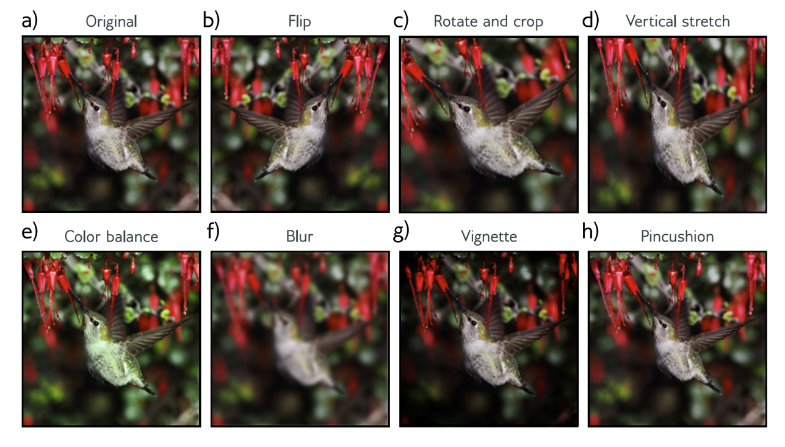{fig-align="center" width="70%"}
</div>

## 3.27 CNNs in the lab: DNA origami (VGG16) {.smaller}
- Goal: characterize the ligation number of **DNA origami** nanostructures in transmission electron microscopy (TEM) images.
<div style="text-align: center;">
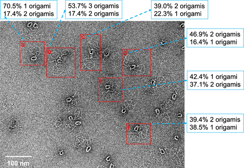{fig-align="center" width="46%"}
</div>

<div style="font-size: 0.6em;">
[1] Characterizing DNA Origami Nanostructures in TEM Images Using Convolutional Neural Networks. Xingfei Wei, Qiankun Mo, Chi Chen, Mark Bathe, and Rigoberto Hernandez. Journal of Chemical Information and Modeling. DOI: 10.1021/acs.jcim.5c00330
</div>


::: {.center}
# 4 From sequences to binding sites {data-name="Project"}
A sneak peek at the final project CNN
:::

## 4.1 The final project: predicting RNA-protein binding {.smaller}
- **RNA-binding proteins (RBPs)** regulate RNA after transcription. **CLIP-Seq** captures short RNA fragments bound to a specific RBP (here: **AGO2**).
- Your CNN learns the function
$$
f(\text{sequence}) = P(\text{binding}\mid \text{sequence})
$$
- Same CNN toolbox as images, but the "image" is now a **sequence**.
- You will: one-hot encode sequences, train a CNN, evaluate with **ROC/AUC**, then read the learned **motifs**.

## 4.2 One-hot encoding RNA sequences {.smaller}
- Each nucleotide (**A, C, G, U**) becomes a column with a single 1 (order **must** match your encoder: A, C, G, U).
- A length-$L$ sequence becomes a $4 \times L$ binary matrix. Padding / unknown bases become uniform $0.25$.

<div style="text-align: center; font-size: 0.8em;">

| | pos 1 (A) | pos 2 (C) | pos 3 (G) | pos 4 (U) |
|:--|:--:|:--:|:--:|:--:|
| **A** | 1 | 0 | 0 | 0 |
| **C** | 0 | 1 | 0 | 0 |
| **G** | 0 | 0 | 1 | 0 |
| **U** | 0 | 0 | 0 | 1 |

</div>

- In the project, sequences are padded / truncated to a fixed length $L = 501$.

## 4.3 A sequence is a $(1 \times 4 \times L)$ "image" {.smaller}
- Stack the one-hot columns into a grid: height $= 4$ (A, C, G, U rows), width $= L$ (position), one dummy channel: input shape $(N, 1, 4, L)$, a batch of tiny grayscale images.
- A $4 \times 10$ filter spans **all four rows** and 10 positions at once, so it slides only along the sequence and **collapses the height to 1**, one value per placement.

<div style="text-align:center;">
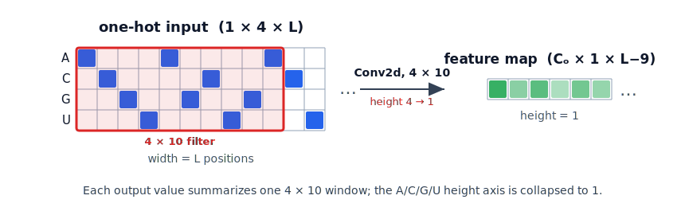{fig-align="center" width="82%"}
</div>

## 4.4 A first-layer filter is a motif detector {.smaller}
- A $4 \times 10$ filter holds one weight per (nucleotide, position) over a 10-base window.
- Sliding it gives a **high activation wherever a preferred 10-mer appears** - a **motif detector**.
- Reading these learned filters back out is the interpretation part of the project.

## 4.5 Your turn: from LeNet to a sequence CNN {.smaller}
The project CNN reuses the **same LeNet building blocks** on the $(1, 4, L)$ sequence "image" - your job is to assemble them.

<div style="font-size:0.8em;">

| Building block | Its job on a sequence |
|:--|:--|
| `Conv2d` | scan for patterns (motifs) |
| `ReLU` | non-linearity |
| `MaxPool` | shrink length, keep strong signals |
| `Flatten` + `Linear` | features into one score |

</div>

- **You choose** (`TODO`): kernel size, number of filters, conv/pool blocks, FC width.
- **Fixed**: first conv spans all 4 rows ($4 \to 1$); final layer `nn.Linear(..., 1)`; **no sigmoid inside** (the loss adds it).

## 4.6 From a score to a probability: the sigmoid {.smaller}
Task 2 predicted a **number** (regression, MSE). Binding is a **yes / no** question, so the CNN's last layer outputs one raw **score (logit)** $z \in \mathbb{R}$: any real number, not yet a probability.

- The **sigmoid** squashes $z$ into $(0,1)$, so we read it as the probability the sequence binds: $\;\hat{p} = \sigma(z) = \frac{1}{1 + e^{-z}}$
- $z \gg 0 \Rightarrow \hat{p} \approx 1$ (binds);  $z \ll 0 \Rightarrow \hat{p} \approx 0$ (does not);  $z = 0 \Rightarrow \hat{p} = 0.5$

<div style="text-align:center;">
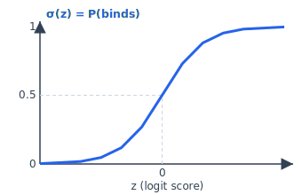{fig-align="center" width="44%"}
</div>

## 4.7 Measuring the error: binary cross-entropy {.smaller}
For sequence $i$: label $y_i \in \{0,1\}$ (1 = binds), model probability $\hat{p}_i = \sigma(z_i)$.

$$
\mathcal{L} = -\frac{1}{N}\sum_{i=1}^{N}\big[\, y_i \log \hat{p}_i + (1-y_i)\log(1-\hat{p}_i) \,\big]
$$

- One term survives per example: the loss asks **"how confident were you in the correct answer?"**

<div style="text-align:center; font-size:0.75em;">

| true $y_i$ | $\hat{p}_i$ | loss |
|:--:|:--:|:--:|
| 1 | 0.99 | 0.01 (great) |
| 1 | 0.50 | 0.69 (unsure) |
| 1 | 0.01 | 4.6 (confident **and** wrong) |

</div>

- In PyTorch: `nn.BCEWithLogitsLoss()` (fused sigmoid + BCE, keep the raw logit $z$).

## 4.8 Evaluating a binary classifier: ROC and AUC {.smaller}
- A **threshold** turns scores into 0/1 calls. Sweeping it from 1 to 0, compute $\text{TPR} = \tfrac{\text{TP}}{\text{TP} + \text{FN}}$ and $\text{FPR} = \tfrac{\text{FP}}{\text{FP} + \text{TN}}$ at each.
- The **ROC curve** plots TPR vs. FPR; the **AUC** (area under it) sums it up in one number (0.5 = chance, 1.0 = perfect).
- Code: `roc_curve`, `roc_auc_score` from `sklearn.metrics`.

<div style="text-align:center;">
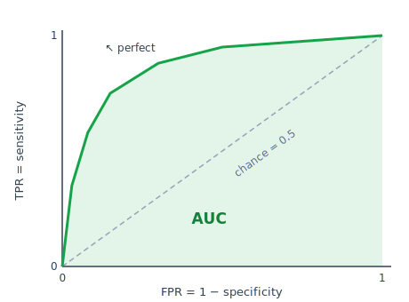{fig-align="center" width="34%"}
</div>


::: {.center}
# 5 Where this goes next {data-name="Beyond"}
Enrichment - not required for the project
:::

## 5.1 Residual connections
- Residual connections add the input back to the output, letting gradients flow more easily through very deep networks.
<div style="text-align: center;">
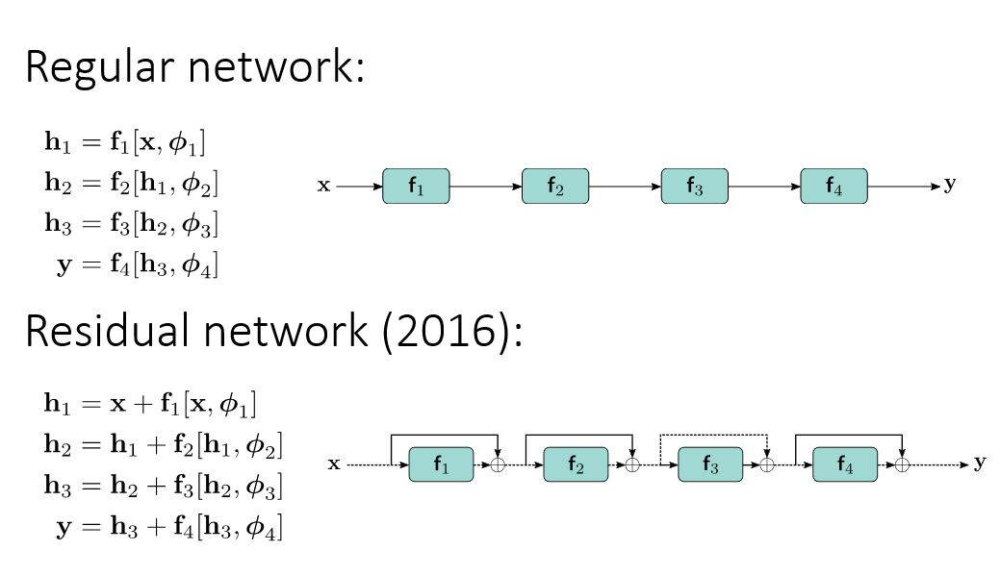{fig-align="center" width="75%"}
</div>

## 5.2 U-Net: segmentation {.smaller}
- A CNN that outputs a label **per pixel** (segmentation), widely used in biomedical imaging.
<div style="text-align: center;">
{fig-align="center" width="58%"}
</div>

## 5.3 U-Net in biology: connectomics {.smaller}
- Segmenting neurons in a full electron-microscopy volume of the **adult Drosophila brain**.
<div style="text-align: center;">
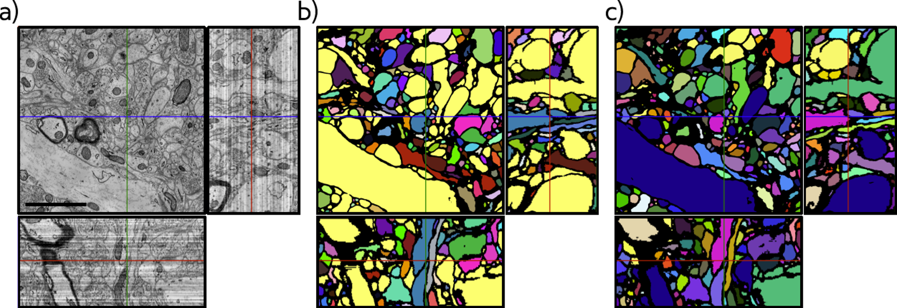{fig-align="center" width="70%"}
</div>

## 5.4 U-Net in biology: mitochondria {.smaller}
- Binary segmentation of **mitochondria** from EM data (train, predict, visualize).
<div style="text-align: center;">
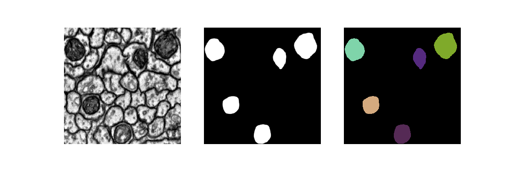{fig-align="center" width="66%"}
</div>

[https://hpc.nih.gov/apps/unet.html](https://hpc.nih.gov/apps/unet.html)


::: {.center}
# 6 Code {data-name="Code"}
:::

## 6.1 LeNet (LeCun, 1998)
<div style="text-align: center;">
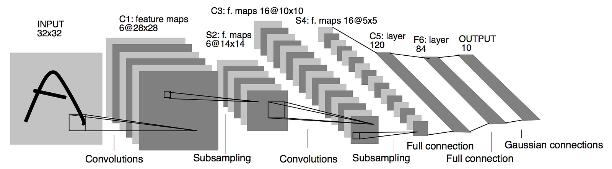{fig-align="center" width="80%"}
</div>

<div style="max-height: 300px; overflow-y: auto;">

```{.python style="font-size: 1.2em;" code-line-numbers="|4,5,6,7,8,9,10|12,13,14,15,16,17,18|19,20,21,22,23" code-overflow="scroll" code-line-wrapping=true}
class LeNet(nn.Module):
    def __init__(self, in_channels=3):
        super().__init__()
        self.feature_extractor = nn.Sequential(
            nn.Conv2d(in_channels, out_channels=6, kernel_size=5),
            nn.ReLU(),
            nn.MaxPool2d(2),
            nn.Conv2d(in_channels=6, out_channels=16, kernel_size=5),
            nn.ReLU(),
            nn.MaxPool2d(2),
        )
        self.classifier = nn.Sequential(
            nn.Linear(16*5*5, 120),  # Why 16*5*5 ?
            nn.ReLU(),
            nn.Linear(120, 84), # (N, 120) -> (N, 84)
            nn.ReLU(),
            nn.Linear(84, 10)   # (N, 84)  -> (N, 10)
        )
    def forward(self, x):
        features = self.feature_extractor(x)
        features = features.view(features.size(0), -1)
        class_scores = self.classifier(features)
        return class_scores
```

</div>

## 6.2 Training LeNet (LeCun, 1998)
- Almost a fully working code
- Almost identical to the network code from the previous tutorial
```{.python style="font-size: 1.2em;" code-line-numbers="|2|3|4|5|6|7|8"}
def train_lenet(model, data, loss_fn, optimizer, num_epochs=10):
    for epoch in range(num_epochs):
        for images, labels in train_loader:
            optimizer.zero_grad()
            outputs = model(images)
            loss = criterion(outputs, labels)
            loss.backward()
            optimizer.step()
```
