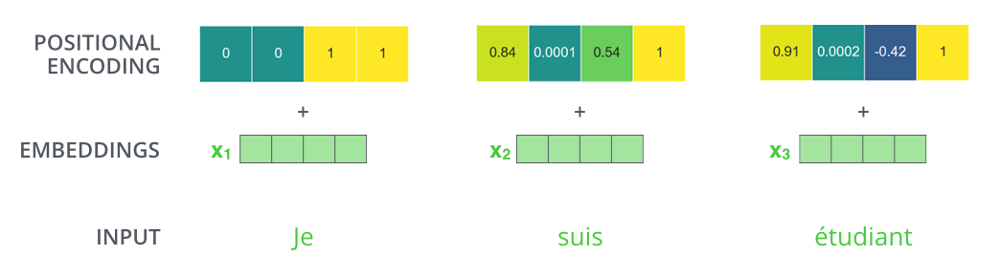
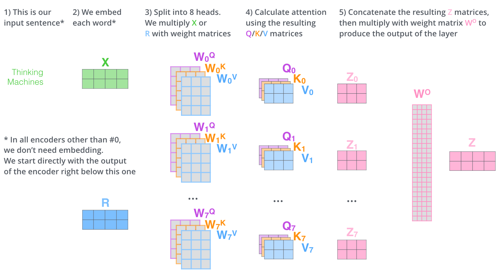
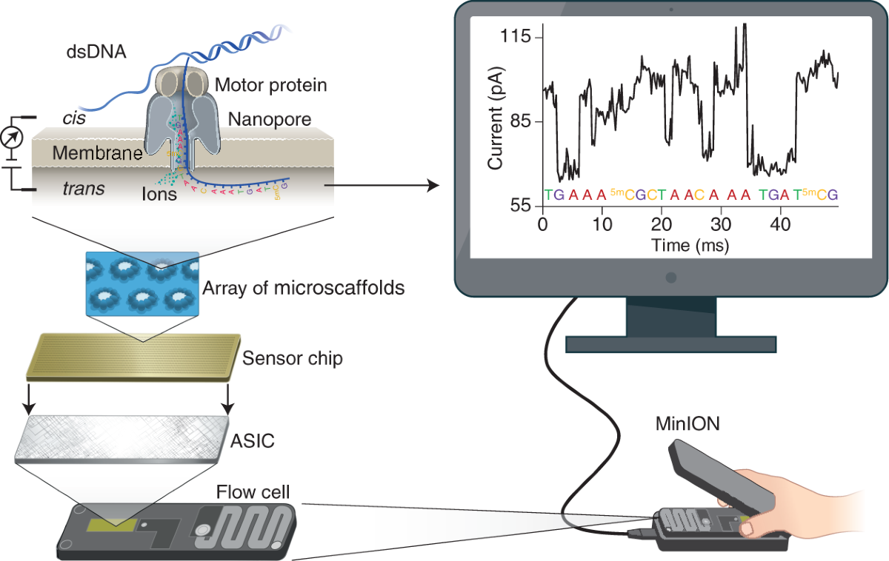
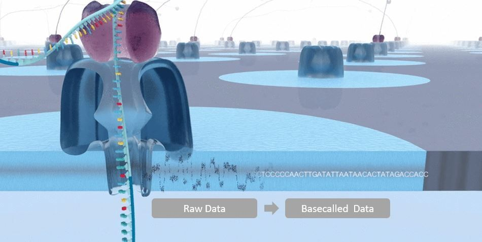

::: {.center}
# 1 Intro
:::

## 1.1 Where we are
- Tut 1-2: regression, neural networks, backpropagation
- Tut 3: **CNNs** - reading local patterns in images and sequences
- **Today**: the architecture behind ChatGPT, modern protein models, and your final project - the **Transformer**

## 1.2 Last week: a CNN for binding sites {.smaller}
- In Tut 3 we met the **CNN** you'll build for the **final project**: read an RNA sequence, predict whether a protein (**AGO2**) binds — bind (1) or not (0).
- First each base is **one-hot** encoded (a *fixed* vector — a 1 in its A/C/G/U slot). Then the **CNN backbone** turns that into a **representation**, and a small **MLP head** gives the answer.

  
A C G U … RNA sequence

  
→

  
<strong>one-hot</strong>

  
→

  
<strong>CNN</strong> backbone

  
→ repr.

  
<strong>MLP</strong> head

  
→

  
<strong>0 / 1</strong> bind / not

::: {.fragment}
> Today we **replace the CNN backbone with a Transformer** — same shape, a more powerful reader.
:::

## 1.3 Interpreting the CNN: what did it learn? {.smaller}
- Accuracy isn't enough — we want to know *why* it says "binds". That's **explainability**.
- The CNN's first-layer filters act as **motif detectors**; two ways to read them out:
  - **Motifs / sequence logos** — score many sequences, keep the high scorers, build a logo (what you do in the project).
  - **In-silico mutagenesis (ISM)** — change each base, measure how the prediction shifts → which positions matter.

::: {.fragment}
> Hold onto this idea — later we'll interpret a **Transformer** the same way, through its **attention**.
:::

## 1.4 Why not MLP? Why not just CNN? {.smaller}
Each architecture fixes the previous one's blind spot:

- **MLP** — mixes inputs but **flattens** them: **no local context** → bad for **images**.
- **CNN** — local filters catch nearby patterns (motifs), but each filter sees only a **small window**: **no global context** → bad for **long-range** (text, long sequences).
- **Transformer** — **attention** sees the **whole sequence at once** → **local *and* global**. ✓

::: {.fragment}
> 🧬 In your project you'll watch a CNN **fail** on exactly a long-range problem.
:::

## 1.5 Today's plan
- **Part 1 - Language models**: pre-training, fine-tuning, tokenization, embeddings, and **attention**
- **Part 2 - Biology**: the *same* models, applied to proteins (**ESM**)
- **Part 3 - Your final project**: a Transformer that reads nanopore signals and calls DNA bases

::: {.fragment}
> One idea - **self-attention** - connects all three.
:::

## 1.6 The Transformer (encoder), at a glance {.smaller}
- This is the **encoder** we build today — one **backbone**. Don't worry about the labels yet; we'll open each block.

  
sequence / signal &nbsp;(input)

  
↓

  
<strong>Tokenize + Embedding</strong> &nbsp;(+ positional encoding)

  
↓

  

    
Encoder block &nbsp;×N

    
<strong>Multi-Head Attention</strong>

    
↓

    
<strong>Feed-Forward</strong>

    
(each with residual + LayerNorm)

  

  
↓

  
<strong>Output head</strong> → prediction

::: {.fragment}
> The one genuinely new piece is **attention** (inside each block) — that's most of today.
:::

::: {.center}
# 2 Language Models {data-name="Language Models"}
:::

## 2.1 What is a language model?
- A model that predicts **the next token** given the previous ones

"The patient was prescribed a course of&nbsp;?"

::: {.fragment}

antibiotics (0.62) &nbsp;·&nbsp; steroids (0.11) &nbsp;·&nbsp; rest (0.05) &nbsp;·&nbsp; …

:::

::: {.fragment}
- Learn $P(\text{next token} \mid \text{context})$ - nothing more
:::

## 2.2 The training data: masking
- Where do labels come from? For **free**, by **masking**: hide a token, ask the model to predict it from the surrounding context.

"the mitochondria is the [MASK] of the cell" → <em>powerhouse</em> 
"DNA is transcribed into [MASK]" → <em>RNA</em> 
"insulin regulates blood [MASK]" → <em>sugar</em>

::: {.fragment}
> Each sentence becomes one training example $(x,y)$ (Tut 1's setup): input $x$ = the masked sentence, label $y$ = the hidden token. No human labelling — 🧬 the same trick masks **amino acids** (Part 2).
:::

## 2.3 One prediction: a backbone and a head
- To turn that masked sentence into a guess, the model works in **two stages**:

  
"the&nbsp;[MASK]&nbsp;is the powerhouse"

  
→

  
<strong>Backbone</strong> (pre-trained)

  
→&nbsp;<strong>z</strong>&nbsp;→

  
<strong>Head</strong>

  
→

  
<em>mitochondria</em>

- **Backbone**: reads the sentence → a **representation** $\mathbf{z}$ (a feature vector).
- **Head**: Tut 1's linear model on top, $h_\theta(\mathbf{z}) = w^\top \mathbf{z} + b$.

## 2.4 Foundation models & fine-tuning
- The **backbone** is the expensive part: trained once on masking over a huge corpus. That reusable backbone is a **foundation model**.
- For a *new* task, keep the backbone and swap in a fresh **task head** (a new $h_\theta$); train briefly — this is **fine-tuning**.

<strong>backbone</strong> (shared, frozen) 
↙&nbsp;&nbsp;&nbsp;&nbsp;↓&nbsp;&nbsp;&nbsp;&nbsp;↘ 
head: disease?&nbsp;
head: sentiment&nbsp;
head: binding site?

::: {.fragment}
> 🧬 In your project: your basecaller is a **backbone** (the attention stack) + a small **head** that outputs A / C / G / T.
:::

## 2.5 The full pipeline
- We have the **backbone + head**. But the backbone reads **numbers**, not text — so two steps turn a sequence into vectors first:

  
"nano&shy;pore sequencing"

  
→

  
<strong>Tokenize</strong>

  
→

  
<strong>Embed</strong>

  
→

  
<strong>Backbone</strong>

  
→&nbsp;<strong>z</strong>&nbsp;→

  
<strong>Head</strong>

  
→

  
output

- We open up those first two boxes next: **tokenization**, then **embedding**.

## 2.6 Step 1: Tokenization
- A sequence is split into **tokens** (word pieces), and each token is given an integer **ID** from a fixed vocabulary.

nano 3711

pore 508

sequ 2199

encing 84

::: {.fragment}
> 🧬 In your project the **signal is tokenized too** - a small convolution turns each base's chunk of current into one token. Same idea, different alphabet.
:::

## 2.7 Step 2: Embedding {.smaller}
- A token **ID** is just an arbitrary number (`pore = 508`) — it carries no meaning on its own.
- The **embedding layer** is a **learned lookup table** $E$ (one row per token): look up the ID, get that token's **vector** $\mathbf{e}\in\mathbb{R}^{d}$ — like the CNN's **one-hot**, a vector per symbol, but **learned** instead of fixed.

"pore" ID = <strong>508</strong> ⬇ look up row 508

<table style="border-collapse:collapse; font-family:monospace; font-size:0.8em; text-align:center;">
<tr style="color:#999;"><td style="padding:3px 12px; text-align:left;">ID</td><td style="padding:3px 12px;">d₁</td><td style="padding:3px 12px;">d₂</td><td style="padding:3px 12px;">d₃</td><td style="padding:3px 12px;">d₄</td><td style="padding:3px 12px;">…</td></tr>
<tr><td style="text-align:left; padding:3px 12px;">507</td><td>0.10</td><td>0.55</td><td>−0.20</td><td>0.31</td><td>…</td></tr>
<tr style="background:#fff3cd; font-weight:bold;"><td style="text-align:left; padding:3px 12px;">508</td><td>−0.72</td><td>0.18</td><td>−0.11</td><td>0.54</td><td>…</td></tr>
<tr><td style="text-align:left; padding:3px 12px;">509</td><td>0.33</td><td>−0.41</td><td>0.62</td><td>0.09</td><td>…</td></tr>
<tr style="color:#999;"><td style="text-align:left; padding:3px 12px;">…</td><td>…</td><td>…</td><td>…</td><td>…</td><td>…</td></tr>
</table>

These numbers <strong>are the weights</strong> — gradient descent edits each row so <strong>related tokens sit close together</strong>.

## 2.8 Step 3: Order matters - positional encoding {.smaller}
- Attention is **blind to order** on its own, so we **add a position signature** to each token

{fig-align="center" width=66%}

Figure: Alammar, <em>The Illustrated Transformer</em> (CC BY-NC-SA 4.0)

::: {.fragment}
> 🧬 You will *test this*: turn positional encoding **off** and watch accuracy collapse.
:::

## 2.9 Attention transforms each token {.smaller}
- Inside the backbone, **self-attention** is what turns each input vector $x_i$ into a new, context-aware vector $z_i$ — each token mixed with the others.

{fig-align="center" width=58%}

Figure: Alammar, <em>The Illustrated Transformer</em> (CC BY-NC-SA 4.0)

## 2.10 A full encoder, stacked {.smaller}
- After attention, each position passes through its own small **feed-forward** network. That pair = one **encoder** — and we **stack several** of them.

{fig-align="center" width=50%}

Figure: Alammar, <em>The Illustrated Transformer</em> (CC BY-NC-SA 4.0)

## 2.11 What attention does: resolving "it" {.smaller}
- So what does "mixing with the others" mean? Each token can **look at every other token** and pull in what it needs.
- Which word does **"it"** refer to? Attention lets "it" look back at the right noun.

{fig-align="center" width=32%}

Figure: Alammar, <em>The Illustrated Transformer</em> (CC BY-NC-SA 4.0)

## 2.12 Attention (1/3): Query, Key, Value {.smaller}
- Each token vector $x_i$ is multiplied by three **learned, shared** matrices to make a **Query** (what I look for), **Key** (what I offer), and **Value** (what I pass on):

$$q_i = W^Q x_i, \qquad k_i = W^K x_i, \qquad v_i = W^V x_i$$

{fig-align="center" width=50%}

Figure: Alammar, <em>The Illustrated Transformer</em> (CC BY-NC-SA 4.0)

## 2.13 Attention (2/3): score each key {.smaller}
- **Score** = **dot product** of the query with each key, $\;q_i \cdot k_j$ — bigger means a better match.

{fig-align="center" width=54%}

Figure: Alammar, <em>The Illustrated Transformer</em> (CC BY-NC-SA 4.0)

## 2.14 Attention (3/3): weights → new vector {.smaller}
::: columns
::: {.column width="55%"}
- The weights come from **token $i$'s own query $q_i$** (softmax over the keys), then multiply the values and **sum**:
$$z_i = \sum_j \text{softmax}_j(\,q_i \cdot k_j\,)\; v_j$$
- The $q_i$ is why $z$ depends on $i$: a **different query → different weights → different $z$**. "Thinking" uses $q_1$ → $z_1$; "Machines" uses $q_2$ → $z_2$.
- Sum runs over **all** tokens → info travels **any distance**.
:::
::: {.column width="45%"}
{width=80%}

Alammar, <em>Illustrated Transformer</em> (CC BY-NC-SA 4.0)

:::
:::

## 2.15 Multi-head attention: run it in parallel {.smaller}
- Do the whole attention (query · key → weights → $z$) **several times at once**, each "head" with its **own** learned $W^Q, W^K, W^V$.
- Each head produces its own output ($Z_0, Z_1, \dots$) — different heads can focus on different relations.

{fig-align="center" width=72%}

Figure: Alammar, <em>The Illustrated Transformer</em> (CC BY-NC-SA 4.0)

## 2.16 Multi-head attention: combine the heads {.smaller}
- **Concatenate** the heads' outputs, then multiply by a learned matrix $W^O$ → one final vector per token.

{fig-align="center" width=72%}

Figure: Alammar, <em>The Illustrated Transformer</em> (CC BY-NC-SA 4.0)

## 2.17 Multi-head attention: the full picture {.smaller}
- Split into heads → attention in each → concatenate → project with $W^O$.

{fig-align="center" width=80%}

Figure: Alammar, <em>The Illustrated Transformer</em> (CC BY-NC-SA 4.0)

## 2.18 The Transformer (encoder): you now know every block {.smaller}
- You've now seen every piece — here's the whole **encoder** again:

  
sequence / signal &nbsp;(input)

  
↓

  
<strong>Tokenize + Embedding</strong> &nbsp;(+ positional encoding)

  
↓

  

    
Encoder block &nbsp;×N

    
<strong>Multi-Head Attention</strong>

    
↓

    
<strong>Feed-Forward</strong>

    
(each with residual + LayerNorm)

  

  
↓

  
<strong>Output head</strong> → prediction

::: {.fragment}
> 🧬 Your project's basecaller is **exactly this stack**.
:::

## 2.19 See it live

<iframe src="https://poloclub.github.io/transformer-explainer/" width="100%" height="690" style="border: 1px solid #ccc" frameborder=0></iframe>

::: {.notes}
Live-demo: type a sentence, show the next-token distribution change, open an attention head and show which words attend to which.
:::

::: {.center}
# 3 Proteins {data-name="Proteins"}
:::

## 3.1 Proteins are sequences too
- A protein is a chain of **amino acids** — a **20-letter** alphabet (like text's words, or DNA's 4 letters).

M K T A Y I A K Q R Q I S F V K …

::: {.fragment}
> Same kind of sequence data → we can use the **same Transformer**, just a different alphabet.
:::

## 3.2 ESM: a language model for proteins {.smaller}
- **ESM** (*Evolutionary Scale Modeling*, from Meta AI) is a Transformer — the same architecture as Part 1 — trained on **~250 million protein sequences**.
- **Trained by masking** (the trick from Part 1): hide an amino acid, predict it from the rest — no labels, just sequences.

  
M K T A ? I A K protein sequence <strong>(input)</strong>

  
→

  
<strong>ESM</strong> Transformer

  
→

  
a <strong>vector per amino acid</strong> its role, in context <strong>(output)</strong>

Rives et al. (2021), PNAS

## 3.3 What ESM learns: structure emerges {.smaller}
- Each amino acid's output **vector** captures its role (which residue, and its context).
- The striking part: **attention learns which residues *touch* in the folded 3D protein** — from sequences alone, never shown a single structure.

<svg viewBox="0 0 620 135" width="72%" xmlns="http://www.w3.org/2000/svg">
  <text x="310" y="12" font-size="12" fill="#555" text-anchor="middle">attention links residues far apart in the chain…</text>
  <line x1="30" y1="98" x2="590" y2="98" stroke="#ccc" stroke-width="3"/>
  <path d="M90,98 Q210,30 330,98" fill="none" stroke="#6a0dad" stroke-width="2.5" stroke-dasharray="5"/>
  <path d="M210,98 Q360,24 510,98" fill="none" stroke="#2e7d32" stroke-width="2.5" stroke-dasharray="5"/>
  <g fill="#fbc02d" stroke="#f9a825" stroke-width="1.5">
    <circle cx="30" cy="98" r="8"/><circle cx="90" cy="98" r="8"/><circle cx="150" cy="98" r="8"/>
    <circle cx="210" cy="98" r="8"/><circle cx="270" cy="98" r="8"/><circle cx="330" cy="98" r="8"/>
    <circle cx="390" cy="98" r="8"/><circle cx="450" cy="98" r="8"/><circle cx="510" cy="98" r="8"/><circle cx="570" cy="98" r="8"/>
  </g>
  <text x="310" y="128" font-size="12" fill="#555" text-anchor="middle">…because they sit close together in the folded 3D protein</text>
</svg>

- This powers **ESMFold**: predict a protein's 3D shape straight from its sequence.

Attention–contact finding: Vig et al. (2021) · ESMFold: Lin et al. (2023), Science

::: {.center}
# 4 Your Final Project {data-name="Project"}
:::

## 4.1 Nanopore sequencing {.smaller}
- A **motor protein** pulls DNA through a tiny **pore**; the bases inside change the **ionic current** → a noisy 1-D **squiggle**.
- The whole device is pocket-sized — the **MinION**.

{fig-align="center" width=58%}

Figure: Wang et al., <em>Nature Biotechnology</em> 39 (2021). doi:10.1038/s41587-021-01108-x

## 4.2 Basecalling = reading the squiggle {.smaller}
- **Basecalling**: turn the raw current **squiggle** → the DNA sequence `ACGT`.
- Modern basecallers (Oxford Nanopore **Dorado**) use **Transformers** — what you just learned.

{fig-align="center" width=60%}

Image: Oxford Nanopore Technologies

## 4.3 How we get data: simulate it
- A **pore model** maps each k-mer (the bases in the pore) → a current level
- Random DNA → look up levels → add noise → a squiggle **with a known answer**
- Perfect labels, for free, no downloads

## 4.4 Input and output {.smaller}
- **Input $X$** — one read's **squiggle**: a vector of **480** current values (60 bases × 8 samples each).
- **Output $Y$** — the **60 bases**, each one of **{A, C, G, T}**.

<strong>X</strong>: [ 0.31, −1.2, 0.80, …, 0.14 ] &nbsp; 480 values = 60 bases × 8 samples

↓ &nbsp;Transformer

<strong>Y</strong>: A C G T A C … G &nbsp; 60 bases ∈ {A,C,G,T}

- Under the hood the model emits a **60 × 4** score grid (4 per base); the **highest** in each row is the called base.

## 4.5 What you build

signal → <strong>tokenizer</strong> → + <strong>positions</strong> → N × [ <strong>attention + feed-forward</strong> ] → <strong>per-base ACGT</strong>

- You **assemble** it from building blocks - every size (`layers`, `width`, `heads`) is your design choice
- **Input**: the current signal · **Output**: for each base, a score for A / C / G / T (highest wins)
- A **loss function** measures how wrong the guess is; training makes it smaller

## 4.6 The twist: why a Transformer?
- Reads come in two **orientations**; a marker somewhere flags reverse reads
- A reverse read must be **complemented** - a decision that depends on a marker that can be **far away**

::: {.fragment}
- **CNN**: local view → misses a far marker → fails on reverse reads
- **Transformer**: global attention → finds the marker → succeeds
:::

::: {.fragment}
> You will *prove* this yourself by breaking a CNN on the task.
:::

## 4.7 Your knobs
::: columns
::: {.column width="50%"}
**Data**
- `noise` - how hard is the signal?
:::
::: {.column width="50%"}
**Model**
- `d_model`, `n_layers`, `n_heads`, `d_ff`
:::
:::

- Explore the trade-off, find a sweet spot under the free-GPU budget
- **Graded partly on accuracy** at a fixed noise level

## 4.8 Practical
- Runs on free **Google Colab / Kaggle** GPUs (a few minutes per model)
- Start small on CPU to debug, then scale up on GPU - mind the quota
- Skeleton notebook: `src/task-2/task-2.ipynb`

::: {.center}
# 5 Wrap-up {data-name="Wrap"}
:::

## 5.1 One idea, three places
- **Language**: attention reads context to predict the next word
- **Proteins**: attention finds residues that touch → structure
- **Your project**: attention finds the marker → correct bases

::: {.fragment}
> Tokenize a sequence, embed it, add positions, let attention look everywhere.
:::

## 5.2 Credits & further reading

- Alammar, J. (2018). *The Illustrated Transformer.* [jalammar.github.io/illustrated-transformer](https://jalammar.github.io/illustrated-transformer/) - figures in Part 1, used under CC BY-NC-SA 4.0.
- Cho et al. *Transformer Explainer.* [poloclub.github.io/transformer-explainer](https://poloclub.github.io/transformer-explainer/)
- Vaswani et al. (2017). *Attention Is All You Need.*
- Rives et al. (2021). *ESM.* · Vig et al. (2021). *BERTology Meets Biology: attention in protein language models.*

## 5.3 משאל המרצה והמתרגל
Open now! We would love to hear your feedback on the course and the tutorials.

{fig-align="center" width=40%}

## 5.4 Good luck!
- Questions: the **Final Project forum** on Moodle
- hoory@campus.technion.ac.il

{width=20%}

## 5.5 VAMOS ARGENTINA! 🇦🇷

{width=40%}

